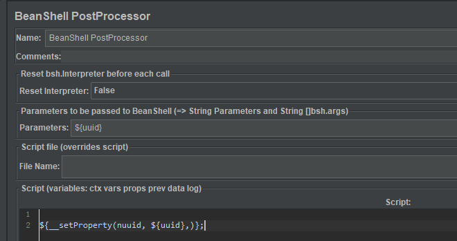
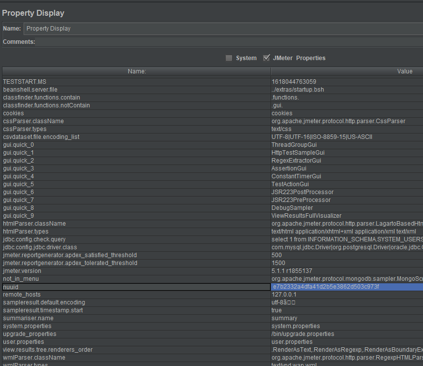

# BeanShell PreProcessor
BeanShell PreProcessor：通常在发送请求前，需要构造输入报文。可用此组件达到目的。

这个我不常用，但是要用的时候又不怎么会用。  
简单的玩法：
## 读写变量
### vars
beanshell的内置变量vars：提供了对**当前线程**变量的读写能力。
* vars.get(String key)：从jmeter中获得变量值  
* vars.put(String key，String value)：数据存到jmeter变量中  

总结一下：哪里的变量可以被vars读写呢？
* 测试计划中的用户自定义变量
* 用户定义的变量
* 随机变量
* 计数器
* ……
只要是全局变量或本线程的局部变量都可以(csv数据文件设置中的变量貌似无法读取)

另外还发现一个，vars.put("A", "a")，相当于创建且赋值了变量A。

### props
beanshell内置变量props：读写jmeter属性，用这个可以读写其他线程的变量

props.put("属性名","属性值")：创建一个属性并赋值
props.get("属性名")：使用BeanShell内置对象获取属性值;

介绍三个jmeter内置函数（可在jmeter任何地方用，当然包括beanshell）

**${__setProperty()}**  
该函数用来给JMeter属性设置值，默认返回值为空字符串，所以在函数在任何地方被调用是有效的

用法：

${__setProperty(property name, property value, True/False)}
* property name : 属性名， 必填  
* property value  :  属性值，必填  
* True/False : 是否返回原始值，非必填，当设置为：true，将返回原始值

作用域：跨线程组调用， 可以在任意地方调用，但不能跟在import xxx 后面  
备注：**入参中的属性名不用加双引号引用**

示例：
1.一般使用搭配参数化使用，如在线程组中提取参数后，可以使用后置处理器进行使用

2.查看是否成功，可以通过变量显示（测试计划->添加->非测试元件），debug sample等；

**${__property()}**  
函数返回JMeter的属性值。如果找不到到属性值而且没有提供默认值，将返回属性名。在有提供默认值时，可以选择不用提供引用名(可选的)。

${__property(property name , variable name, default value)}
* porperty name:  要检索的属性名，必填
* variable name： 引用名，用于被赋值的变量，非必填
* default value：默认值，非必填

      ${__ property(uuid)} ：
      返回uuid的值

      ${__property(uuid, aa)} ：
      拿到uuid的值并将uuiduuid赋值给 aa;

      ${__property(uuid, aa, abc)}:  
      拿到uuid的值，如果uuid未定义即找不到，则把默认值abc的变量值赋值给aa,如果默认值未定义则返回默认值的属性名；

      ${__property(uuid, , abc)}: 
      返回的是匿名变量名，拿到uuid, 如果默认变量有赋值，则把abc的变量值赋值返回，如果默认值没有定义，则任何默认值的变量名；

**${__P()}**

用法：  
${__P(property name(要检索的属性名，必填）, default value（默认值，非必填，不填默认为1)}  
作用域：可以跨线程使用  
注意：两个变量之间一定要用“，”隔开，如果变量中包含，需要要“\”反斜线转义  
支持在命令行与beanshell中使用

__P是__property函数的简化版，用来返回jmeter属性的值，可以在命令行中使用也可以在beanshell中用，

举个例子：

${__P(prop1)} 会返回属性prop1的值；${__P(prop1,www.bidu.com)} 会返回属性prop1的值，如果prop1未定义值，则返回www.baidu.com；

用法上__property函数仅仅是比__P函数多了一个可以存值的变量，举例：  
${__property(prop1,var1,shanghai)}会返回prop1的值，如果prop1未定义值则会返回shanghai，同时会将prop1的值存到变量var1中

总结：

${__setProperty()}与${__property()}/${__P()}一起配合使用，setProptety等于把值拿出来，
__property/__P   
1.可以把setProperty 的值直接拿出来  
2.可以对已存在的变量重新赋值

### log
log.info(String str)：有两个地方可以看这log。一是点击jmeter客户端右上角的黄色三角形感叹号；
二是日志写入了./bin/jmeter.log中。

### 引入外部文件
#### 引入java文件
在beanshell组件中引入：

    source("D://xxx.java");
然后就能用该java文件的类和函数了。
#### addClassPath
一个java文件不够用？那就引入整个项目，再通过import引用该目录下的类。
 
    addClassPath("D://xxx/src")
    //引入
    import mutest.Md5Encryption;

    String passwordIni = "123456";
    // 调用加密方法
    String passwordEncryp = new Md5Encryption().md5Encryption(passwordIni);
    vars.put("passwordEncryp",passwordEncryp);
#### 引入jar包
将项目打成jar包，导入JMeter安装目录\lib\etc中，并重启JMeter。然后直接在beanshell组件中import。