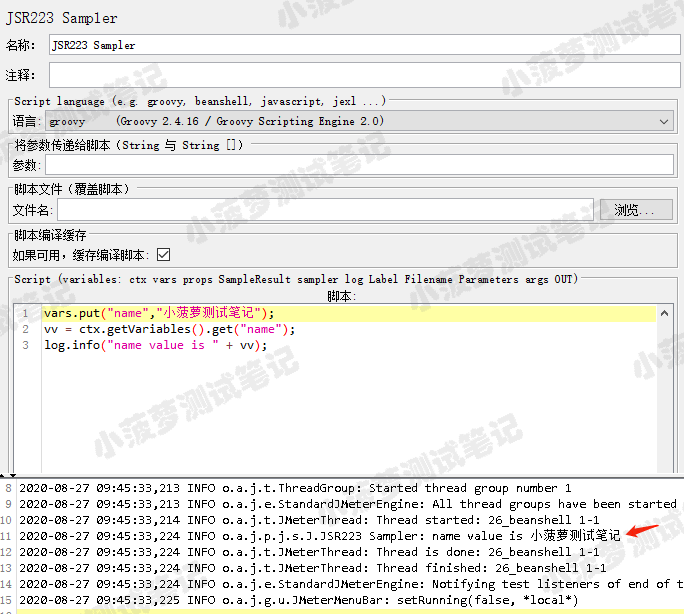
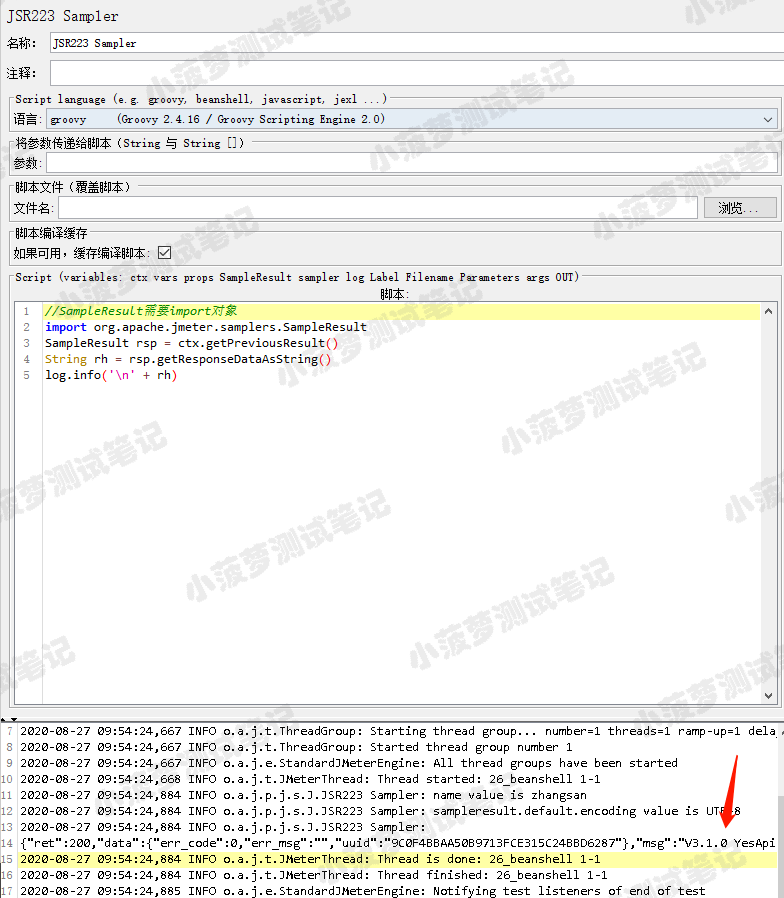

# 简单介绍
ctx 变量是JMeter JSR223功能最强大的内置变量之一
* 通过它可以轻松的访问当前线程的上下文
* 在 JMeter 内部，ctx 映射为 org.apache.jmeter.threads 的 JMeterContext 类
* 由于JMeterContext 不具有线程安全性，故仅适用于在单线程中使用 
* 官方文档： https://jmeter.apache.org/api/org/apache/jmeter/threads/JMeterContext.html
 

# ctx 常用方法
## getVariables
* 方法声明  
public JMeterVariables getVariables()

* 功能  
获取JMeter当前线程的所有变量

* 栗子

## getProperties
* 方法声明  
public Properties getProperties()

* 功能  
获取所有的JMeter属性

* 栗子

## getPreviousResult
* 方法声明  
public SampleResult getPreviousResult()

* 功能  
获取前一个取样器的结果

* 栗子  
获取前一个 sampler 的响应内容

  

 

## getCurrentSampler
* 方法声明  
public Sampler getCurrentSampler()

* 功能  
获取当前取样器对象

* 栗子

## getPreviousSampler
* 方法声明  
public Sampler getPreviousSampler()

* 功能
获取前一个取样器对象

* 栗子

## getThreadNum
* 方法声明
public int getThreadNum()

* 功能
获取当前线程组下的线程编号(编号从0开始)

* 栗子

## getThread
* 方法声明  
public JMeterThread getThread()

* 功能
获取线程对象

* 栗子

## getThreadGroup
* 方法声明  
public AbstractThreadGroup getThreadGroup()

* 功能
获取线程组对象

* 栗子

