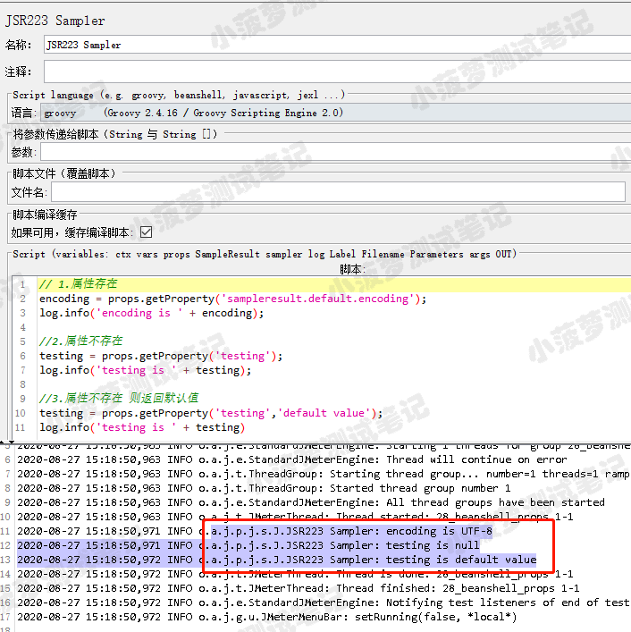
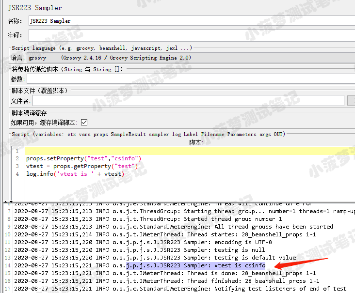
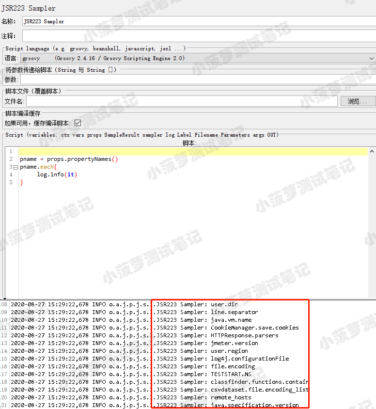
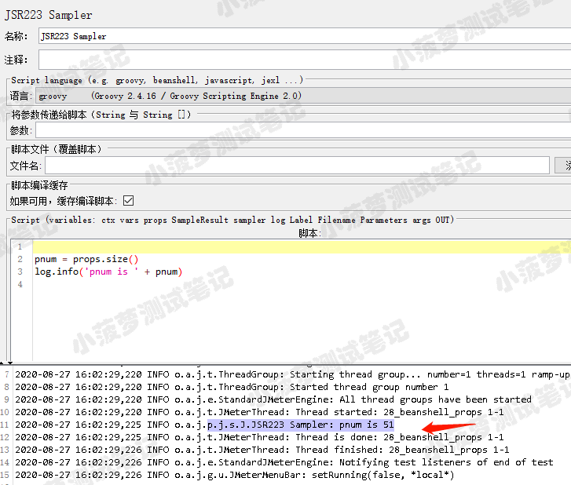

# 简单介绍
* props 映射 java.util 的 Properties 类
* 与 vars 作用大致相同，区别的是 vars 是对变量进行读写操作， 而 props 主要是对属性进行读写操作
* vars 只能在当前线程组内使用，props 可以跨线程组使用 ，因为属性可以跨线程组但是变量不行
* vars 只能保存 String 或者 Object，props 可以是 Hashtable 或者 Object
* java.util.Properties 这个类是线程安全的；多个线程可以共享一个 Properties 对象，而不需要外部同步
* 官方文档： https://tool.oschina.net/uploads/apidocs/jdk-zh/java/util/Properties.html
 

# props常用方法
## getProperty
* 方法声明  
public String getProperty(String key)  
public String getProperty(String key, String defaultValue)：当 key 不存在则返回默认值  

* 功能
用指定的键在此属性列表中搜索属性，如果在此属性列表中未找到该键，则接着递归检查默认属性列表及其默认值。如果未找到属性，则此方法返回 null

* 栗子

## setProperty
* 方法声明  
public Object setProperty(String key,String value)

* 功能  
设置属性值

* 栗子

## propertyNames
* 方法声明
public Enumeration<?> propertyNames()

* 功能  
返回属性列表中所有键的枚举，如果在主属性列表中未找到同名的键，则包括默认属性列表中不同的键

* 栗子

## size
* 方法声明  
public int size()

* 功能  
返回有多少个属性

* 栗子

## 查看测试计划中所有jmeter属性
右键测试计划->非测试元件—>Property Display