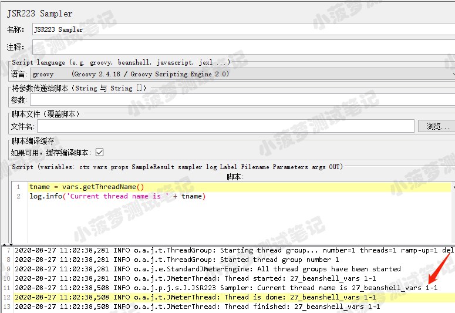
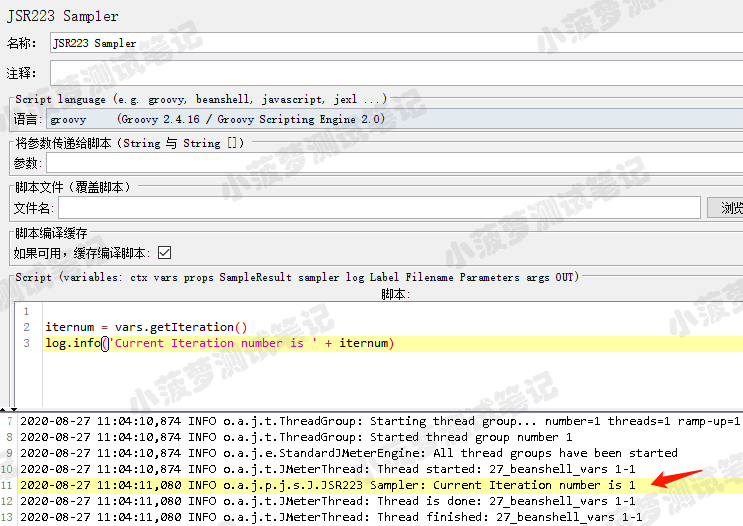
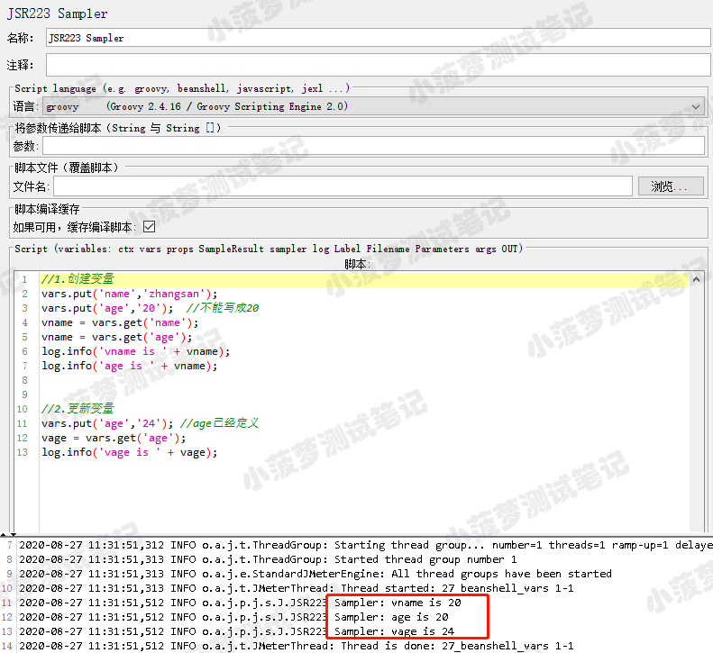
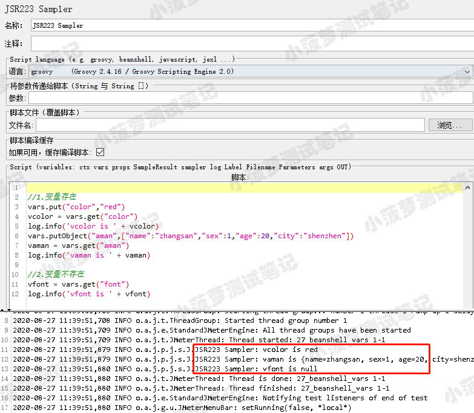
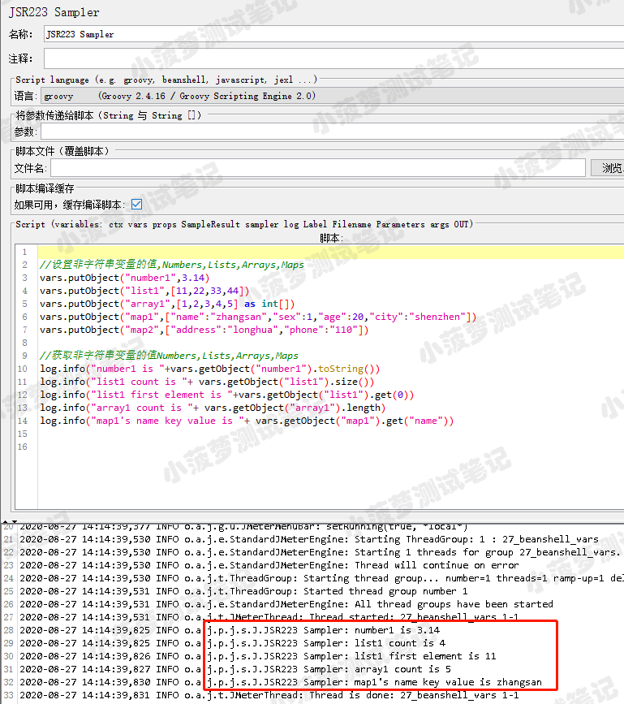
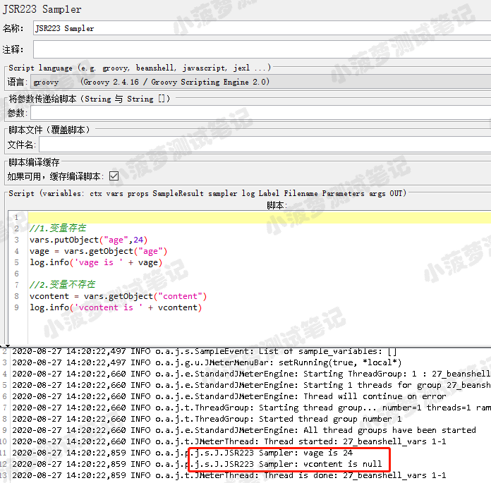
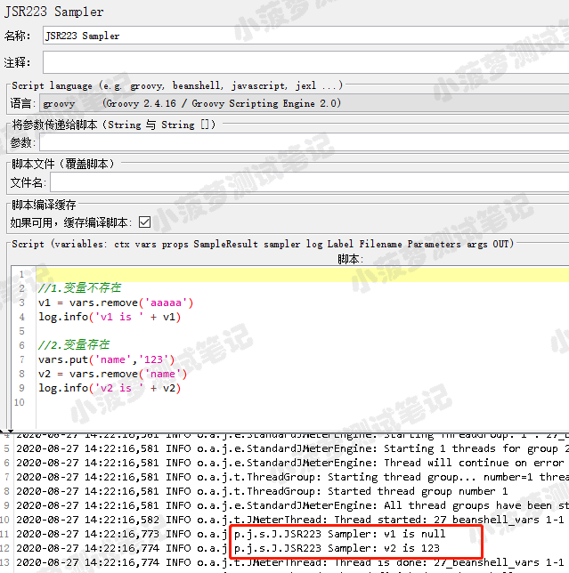

# 简单介绍
* vars 是最常用的JMeter变量之一
* 在 JMeter 内部，映射 org.apache.jmeter.threads 的 JMeterVariables 类
* vars 提供了对**当前线程变量**的读写能力
* 所有的 JMeter 变量都是 java字符串
* 如果你需要把数据存放到一个 JMeter 变量中，需要先将它转换成字符串
* 官方文档：https://jmeter.apache.org/api/org/apache/jmeter/threads/JMeterVariables.html
 

# vars常用方法
## getThreadName
* 方法声明  
public String getThreadName()

* 功能  
获取当前运行线程名

* 栗子

## getIteration
* 方法声明  
public int getIteration()

* 功能  
获取线程当前的迭代号

* 栗子

## put
* 方法声明  
public void put(String key, String value)

* 功能  
创建或更新字符串变量，key变量名，value变量值

* 栗子

## get
* 方法声明  
public String get(String key)

* 功能  
获取变量的值并将其转换为字符串，若变量存在则将值转换为字符串，否则返回 null

* 栗子

## putObject
* 方法声明  
public void putObject(String key,Object value)

* 功能  
创建或更新一个非字符串变量。key变量名，value变量值

* 栗子

## getObject
* 方法声明  
public Object getObject(String key)

* 功能  
获取变量的值（不转换为字符串）。若变量不存在则返回null

* 栗子

## remove
* 方法声明  
public Object remove(String key)

* 功能
删除一个变量，并返回变量的值，若变量不存在则返回 null

* 栗子  

 

