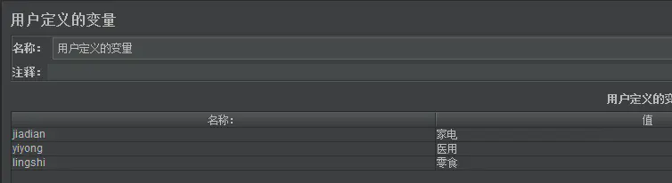
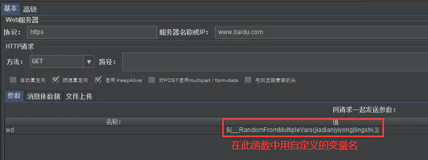
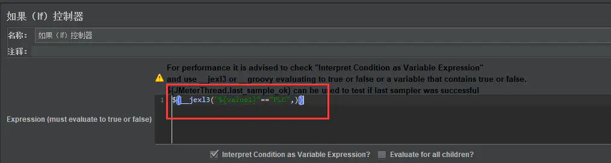
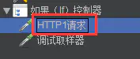

# Jmeter常见内置函数

**这个网址总结的不错**  
https://www.cnblogs.com/poloyy/p/15257716.html

## _time函数

将当前系统的时间转换成需要的格式，包括时间戳、年月日时分秒等格式

${__time(时间格式,存储结果的变量名（可选）)}

    ${__time(,)}：将当前系统时间转换成时间戳，返回的是int
    ${__time("yyyy-MM-dd HH:mm:ss",mytime)}:返回格式化的当前时间（String类型），并存入变量mytime
             第一个入参不加引号也行，不过返回的不是String类型。

## _timeShift函数
支持对时间加减  
${__timeShift(时间格式,,加减时间,,存储结果的变量名（可选）)}  
比如：${__timeShift(yyyy-MM-dd HH:mm:ss,,P-2DT-10H+17M-10S,,)  
（1）对时间进行加减操作，需要使用首字母P  
（2）要进行"天"的操作，需要使用字母D  
（3）要进行"时分秒"的操作，需要使用字母T  

上面的表达式"P-2DT-10H+17M-10S"表示的意思就是：在当前时间下，天数减2天(-2D)，小时减10小时(-10H)，分钟加17分钟(+17M)，秒数减10秒(-10S)；比如，当前时间是2021-3-24 16：33：20 那么用了这个表达式后就变成了2021-3-22 06：50：10。

## __Random
生成随机整数
  
    //随机生成 0 - 10 的数字，可通过 ${num} 引用此数字
    ${__Random(0,10, num)}

## __RandomDate
生成随机日期

    //从现在到 2050-07-08 之间，将返回一个随机日期
    ${__RandomDate(,,2050-07-08,,)}

## __RandomString  
在给定的"源字符串"中，随机选取指定长度的字符串，选取的每个字符可以相同

    //返回从 abcdefg 集合中选取的 10 个字符的随机字符串，例如cdbgdbeebd、adbfeggfad
    ${__RandomString(10,abcdefg)}

## __RandomFromMultipleVars
在指定的几个参数值中，随机选取一个值。"源变量"之间一定要用"|"符号进行分割。”源变量“需要添加到用户变量里边，在__RandomFromMultipleVars函数中引用他的变量名。

## __jexl3函数
和if逻辑控制器配套使用，用来判断表达式是否达到预期再决定是否执行if控制器里面的逻辑。 

## __MD5(,)
将指定的字符串 MD5 加密并返回，加密后是 32位小写  

    ${__MD5(abcdef,)}

## __digest(,,,,)
这个也是加密，可选择的加密算法变多了.

| 字段 | 含义 | 必传 |
| ------| ------ | ------ |
| Algorithm | MD2/MD5/SHA-1/SHA-224/SHA-256/SHA-384/SHA-512 | Y |
| String to encode | 将被加密的字符串 | Y |
| Salt to add | 盐值 | N |
| Upper Case value | 结果默认为小写（False）  True：结果为大写 | N |
| Variable name | 引用返回值的变量名 | N |

下面这两个是一样的

    ${__digest(MD5,123456,,,)}
    ${__MD5(123456,)}

## __strLen(,)
读取给定字符串的长度

    ${__strLen(123456,)}

## __BeanShell(,)
还有此等神器！执行 BeanShell 脚本，并返回结果

    ${__BeanShell(vars.put("yytest"\,"${__Random(1000,5555)}"),)}
    ${__BeanShell(props.get("yytest"),)}

## __V()  
执行变量名表达式，并返回执行结果。可用于嵌套函数。  

举个栗子，当前有两个变量 A1、A2，还有一个 N = 1

    ${A1} ：可以正常引用
    ${A${N}} ：不可以这样使用，因为不支持函数嵌套
    ${__V(A${N})} ：可以这样使用， A${N}  会变成 A1 ，__V 函数会返回 A1 
 

## ${__setProperty()} 
该函数用来给JMeter属性设置值，默认返回值为空字符串，所以在函数在任何地方被调用是有效的

用法：

${__setProperty(property name, property value, True/False)}
* property name : 属性名， 必填  
* property value  :  属性值，必填  
* True/False : 是否返回原始值，非必填，当设置为：true，将返回原始值

作用域：跨线程组调用， 可以在任意地方调用，但不能跟在import xxx 后面  
备注：**入参中的属性名不用加双引号引用**

## ${__property()}  
函数返回JMeter的属性值。如果找不到到属性值而且没有提供默认值，将返回属性名。在有提供默认值时，可以选择不用提供引用名(可选的)。

${__property(property name , variable name, default value)}
* porperty name:  要检索的属性名，必填
* variable name： 引用名，用于被赋值的变量，非必填
* default value：默认值，非必填

      ${__ property(uuid)} ：
      返回uuid的值

      ${__property(uuid, aa)} ：
      拿到uuid的值并将uuiduuid赋值给 aa;

      ${__property(uuid, aa, abc)}:  
      拿到uuid的值，如果uuid未定义即找不到，则把默认值abc的变量值赋值给aa,如果默认值未定义则返回默认值的属性名；

      ${__property(uuid, , abc)}: 
      返回的是匿名变量名，拿到uuid, 如果默认变量有赋值，则把abc的变量值赋值返回，如果默认值没有定义，则任何默认值的变量名；

## ${__P()}

用法：  
${__P(property name(要检索的属性名，必填）, default value（默认值，非必填，不填默认为1)}  
作用域：可以跨线程使用  
注意：两个变量之间一定要用“，”隔开，如果变量中包含，需要要“\”反斜线转义

__P是__property函数的简化版，用来返回jmeter属性的值，可以在命令行中使用也可以在beanshell中用，

举个例子：

${__P(prop1)} 会返回属性prop1的值；  
${__P(prop1,www.bidu.com)} 会返回属性prop1的值，如果prop1未定义值，则返回www.baidu.com；

用法上__property函数仅仅是比__P函数多了一个可以存值的变量，举例：  
${__property(prop1,var1,shanghai)}会返回prop1的值，如果prop1未定义值则会返回shanghai，同时会将prop1的值存到变量var1中