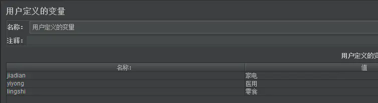
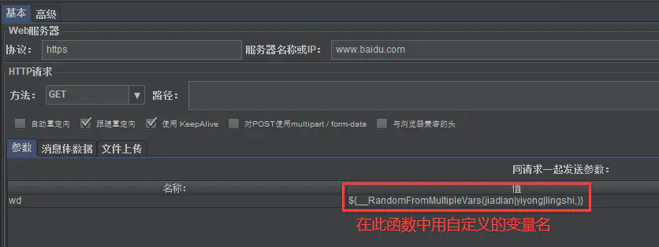
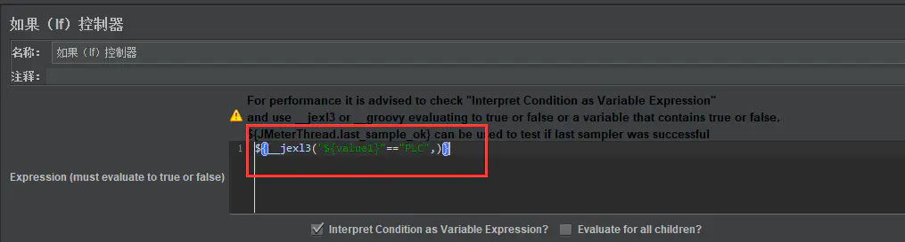
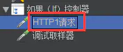

# Jmeter常见内置函数

**这个网址总结的不错**  
https://www.cnblogs.com/poloyy/tag/Jmeter%20%E5%B8%B8%E7%94%A8%E5%87%BD%E6%95%B0/default.html?page=1

##_time函数

将当前系统的时间转换成需要的格式，包括时间戳、年月日时分秒等格式

${__time(时间格式,存储结果的变量名（可选）)}

    ${__time(,)}：将当前系统时间转换成时间戳，返回的是int
    ${__time("yyyy-MM-dd HH:mm:ss",mytime)}:返回格式化的当前时间（String类型），并存入变量mytime
             第一个入参不加引号也行，不过返回的不是String类型。

##_timeShift函数
支持对时间加减  
${__timeShift(时间格式,,加减时间,,存储结果的变量名（可选）)}  
比如：${__timeShift(yyyy-MM-dd HH:mm:ss,,P-2DT-10H+17M-10S,,)  
（1）、对时间进行加减操作，需要使用首字母P  
（2）、要进行"天"的操作，需要使用字母D  
（3）、要进行"时分秒"的操作，需要使用字母T  

上面的表达式"P-2DT-10H+17M-10S"表示的意思就是：在当前时间下，天数减2天(-2D)，小时减10小时(-10H)，分钟加17分钟(+17M)，秒数减10秒(-10S)；比如，当前时间是2021-3-24 16：33：20 那么用了这个表达式后就变成了2021-3-22 06：50：10

##__Random
生成随机整数

##__RandomDate
生成随机日期

##__RandomString函数 
在给定的"源字符串"中，随机选取指定长度的字符串，选取的每个字符可以相同

##__RandomFromMultipleVars
在指定的几个参数值中，随机选取一个值。"源变量"之间一定要用"|"符号进行分割。”源变量“需要添加到用户变量里边，在__RandomFromMultipleVars函数中引用他的变量名。

##__jexl3函数
和if逻辑控制器配套使用，用来判断表达式是否达到预期再决定是否执行if控制器里面的逻辑。 

##__MD5(,)
将指定的字符串 MD5 加密并返回，加密后是 32位小写  

    ${__MD5(abcdef,)}

##__digest(,,,,)
这个也是加密，可选择的加密算法变多了.

| 字段 | 含义 | 必传 |
| ------| ------ | ------ |
| Algorithm | MD2/MD5/SHA-1/SHA-224/SHA-256/SHA-384/SHA-512 | Y |
| String to encode | 将被加密的字符串 | Y |
| Salt to add | 盐值 | N |
| Upper Case value | 结果默认为小写（False）  True：结果为大写 | N |
| Variable name | 引用返回值的变量名 | N |

下面这两个是一样的

    ${__digest(MD5,123456,,,)}
    ${__MD5(123456,)}

##__strLen(,)
读取给定字符串的长度

    ${__strLen(123456,)}

##__BeanShell(,)
还有此等神器！执行 BeanShell 脚本，并返回结果

    ${__BeanShell(vars.put("yytest"\,"${__Random(1000,5555)}"),)}
    ${__BeanShell(props.get("yytest"),)}

##__V()
嵌套函数