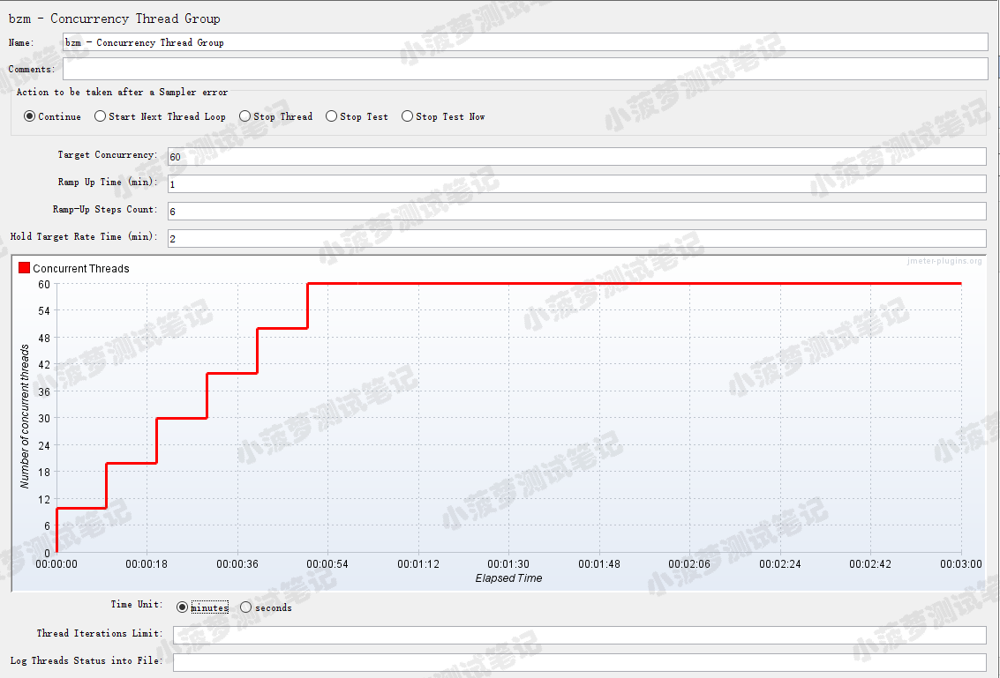
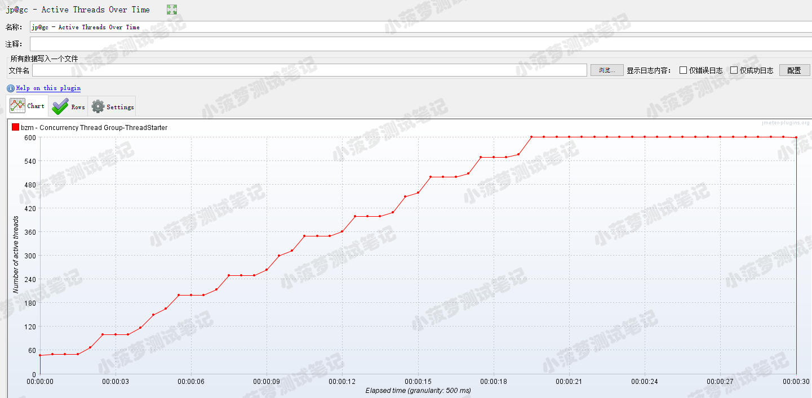

# 简介
JMeter 阶梯式加压测试插件：
1. Concurrency Thread Group
2. Stepping Thread Group。 

Stepping Thread Group插件已不被官方所推荐，那么Concurrency Thread Group优势在哪？  
官方说法是：
* Concurrency Thread Group提供了配置线程调度的简化方法。

    增加了两个可配置属性
  * dynamictg.propertiescaching_validity：配置刷新线程组属性值的频率。会刷新该线程组属性值。其默认是20ms,降低此值可以获得更高的刷新率，并不是越低越好，要注意潜在的性能影响。
  * dynamic_tg.temporisation：目的是在尚未创建动态线程时避免rampup启动时出现CPU峰值。默认值为10毫秒。

* 它的目的是保持并发性级别，这意味着如果没有足够的线程并行运行，那么在运行时线程期间启动额外的线程。

* 它不会预先创建所有线程，因此不会使用额外的内存。

* 对于步进线程组来说，这是一个很好的补充，因为它允许线程优雅地完成它们的工作。

# 参数讲解

* Target Concurrency：目标并发（线程数）
* Ramp Up Time：启动时间；若设置 1 min，则目标线程在1 imn内全部启动
* Ramp-Up Steps Count：阶梯次数；若设置 6 ，则目标线程在 1min 内分六次阶梯加压（启动线程）；每次启动的线程数 = 目标线程数 / 阶梯次数 = 60 / 6 = 10
* Hold Target Rate Time：持续负载运行时间；若设置 2 ，则启动完所有线程后，持续负载运行 2 min，然后再结束
* Time Unit：时间单位（分钟或者秒）
* Thread Iterations Limit：线程迭代次数限制（循环次数）；默认为空，理解成永远，如果运行时间到达Ramp Up Time + Hold Target Rate Time，则停止运行线程【不建议设置该值】
* Log Threads Status into File：将线程状态记录到文件中（将线程启动和线程停止事件保存为日志文件）；

**特别注意点**
* Target Concurrency只是个期望值，实际不一定可以达到这个并发数，得看上面的配置【电脑性能、网络、内存、CPU等因素都会影响最终并发线程数】
* Jmeter会根据Target Concurrency的值和当前处于活动状态的线程数来判断当前并发线程数是否达到了Target Concurrency；若没有，则会不断启动线程，尽力让并发线程数达到Target Concurrency的值

# 举例

* 第一个关注点：阶梯增压过程  
看Concurrency Thread Group负载预览图每次阶梯增压都是瞬时增压的，但是实际测试结果可以看到它也是有一个过渡期，并不是瞬时增压

* 第二个关注点：持续负载运行结束后，所有线程瞬时释放
  * 从图最后可以看到，所有线程都是瞬时释放的
  * 普通的线程组有三种状态：启动、运行、释放；而Concurrency Thread Group的线程可以理解成只有两种状态：启动、运行；因为线程都在极短的时间内就结束了

**Concurrency Thread Group和Stepping Thread Group的区别**  
官方说法
* Stepping Thread Group不提供设置启动延迟时间，阶梯增压过渡时间，阶梯释放过渡时间，但Concurrency Thread Group提供
* Stepping Thread Group可以阶梯释放线程，而Concurrency Thread Group是瞬时释放（具体看下面介绍）
* Stepping Thread Group设置了需要启动多少个线程就会严格执行，Concurrency Thread Group会尽力启动线程达到Target Concurrency值