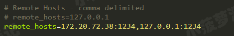
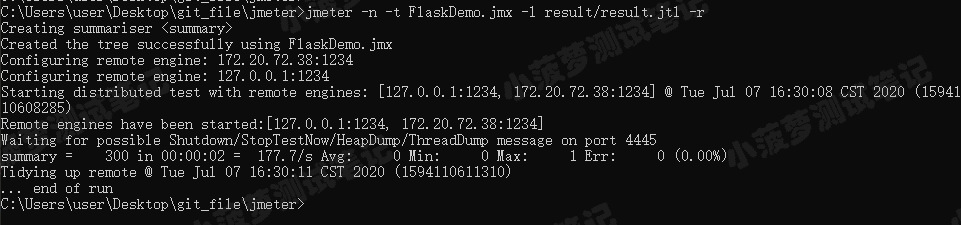
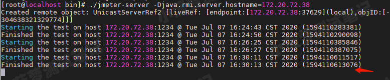
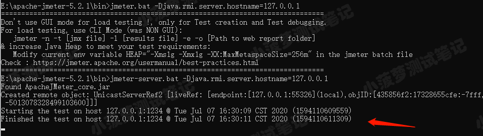
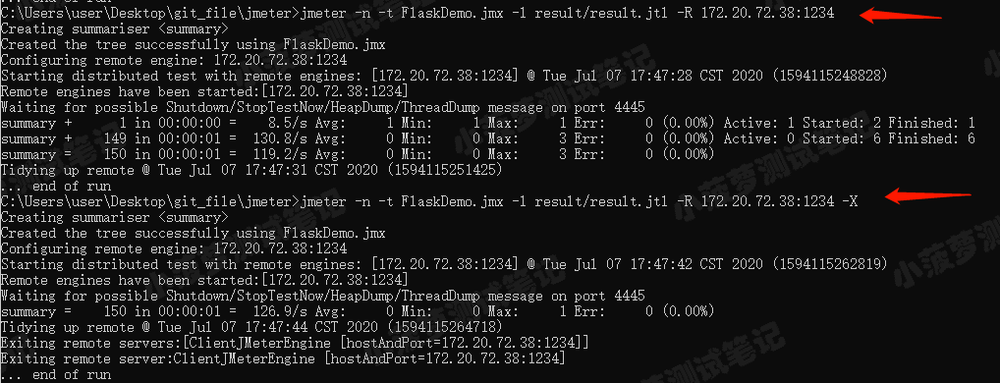
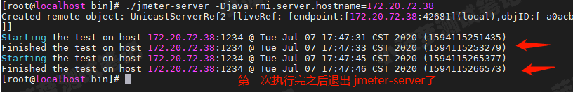

CLI模式，即命令行模式。

# CLI 模式可选参数
| 字段 | 含义 | 
| ------| ------ | 
| -n | 指定jmeter在cli模式运行 | 
| -t | 指定执行的jmx文件 | 
| -l | 指定记录测试结果的jtl文件名 | 
| -e | 生成html格式的测试报表 | 
| -o | 生成测试报表的文件夹，文件夹必须不存在或为空 | 
| -g | 输出报告文件 | 
| -j | 记录jmeter运行日志的文件名和文件路径 | 

栗子（-n,-t,-l,-e,-o）：

      //执行jmx脚本，并在result目录下生成 report.jtl 报告
      //report.jtl存在也没关系，可以自动覆盖
      jmeter -n -t FlaskDemo.jmx -l result/report.jtl

      //执行jmx脚本,生成jtl报告，最后在report目录下生成测试报表
      //切记：report.jtl必须不存在，report目录必须不存在或者为空
      jmeter -n -t FlaskDemo.jmx -l result/report.jtl -e -o report

栗子（-g）：

      //jtl文件转html测试报告
      jmeter -g report.jtl -o report

# 服务器相关参数
| 字段 | 含义 |
| ----- | ----- |
| -r | 所有远程服务器中运行测试 |
| -R | 在指定的远程服务器中运行测试 |
| -X | 服务器运行完脚本后自动停止 jmeter-server |
| -H | 代理服务器的host或ip |
| -P | 代理服务器的port |
|  |  |

栗子（-r）：

    //会执行 jmeter.properties 的 remote_hosts 填的所有远程slave机
    jmeter -n -t FlaskDemo.jmx -r -l result/report.jtl

   1.设置jmeter属性
    
   2.master机执行命令
    
   3.slave机
    
   4.本地slave机
    

栗子（-R）：

    //启动指定的远程slave机执行jmx，并在result目录下生成report.jtl  
    jmeter -n -t FlaskDemo.jmx -l result/report.jtl  -R 172.20.72:38:1234
  
栗子（-X）：

    jmeter -n -t FlaskDemo.jmx -l result/report.jtl  -R 172.20.72:38:1234 -X

   1.master 机，跑了两次，第一次没有 -X，第二次加了 -X
    
   2.slave 机
    

# 属性参数
Java 系统属性和 JMeter 属性可以直接通过以下命令进行覆盖，而不用手动修改 jmeter.properties

| 格式 | 含义 |
| ----- | ----- |
| -D[prop_name]=[value]|	定义一个 Java 系统属性值|
|-J[prop_name]=[value]	|定义本地 JMeter 属性|
|-G[prop_name]=[value]	|定义要发送到所有远程服务器的 JMeter 属性|
|-G[propertyfile]	|定义一个包含 JMeter 属性的文件，该文件将发送到所有远程服务器|
|-L[category]=[priority]|覆盖日志记录设置，将特定类别设置为给定的优先级；设置根日志记录级别 |

    jmeter -n -t xxx.jmx -l xxx.jtl -JclientId 8C3wdasdqd

# 后台运行模式
* nohub：不挂断的运行，可以使命令永久的执行下去，即使断开SSH连接也不会影响命令的执行。**注意：nohup没有后台运行的意思**。
    
      语法：nohup Command [ Arg … ] [　& ]
          无论是否将 nohup 命令的输出重定向到终端，输出都将附加到当前目录的 nohup.out 文件中。

          如果当前目录的 nohup.out 文件不可写，输出重定向到 $HOME/nohup.out 文件中。
          
          如果没有文件能创建或打开以用于追加，那么 Command 参数指定的命令不可调用。
* &：在后台运行，当用户退出（挂起）的时候，命令自动跟着结束。

栗子：  
1. sh test.sh &  
   将sh test.sh任务放到后台 ，关闭xshell，对应的任务也跟着停止
2. nohup sh test.sh &  
   1. 将sh test.sh任务放到后台，但是依然可以使用标准输入，终端能够接收任何输入，重定向标准输出和标准错误到当前目录下的nohup.out文件。  
   2. 即使关闭xshell退出当前session依然继续运行

## 输出重定向
在shell中,文件描述符通常是:STDIN标准输入,STDOUT标准输出,STDERR标准错误输出,即:0,1,2

作业在后台运行的时候，可以把输出重定向到某个文件中，相当于一个日志文件，记录运行过程中的输出。

使用方法：nohup command > nohup.log 2>&1 &

command>nohup.log是将command的标准输出重定向到nohup.log文件，输出内容不打印到屏幕上。

2>&1是把STDERR重定向到前面标准输出定向到的同名文件中，即&1就是nohup.log。