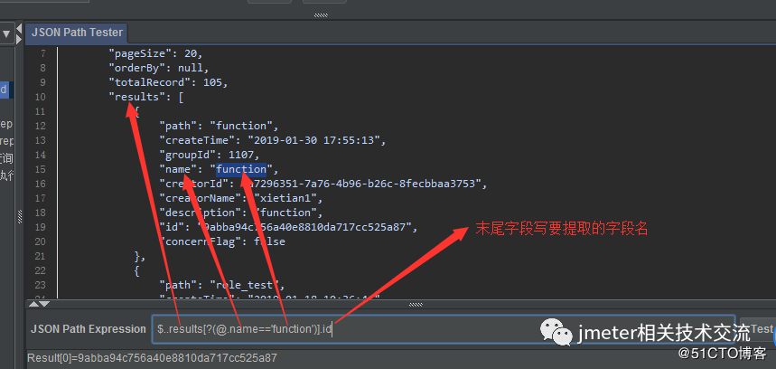

# Jmeter断言
Jmeter有好几种断言，响应断言，json断言，BeanShell断言等。前面两种断言比较简单，粗略介绍下。
## 响应断言
既可对响应内容断言，也可对请求内容断言

**Field to Test**  
需要断言 JMeter 测试请求或响应中的哪个字段

* Text Response：响应文本，结果树的响应数据里的内容
* Response Code：响应码，在结果树的取样器结果中可看到
* Response Message：响应信息，在结果树的取样器结果中可看到  

* Response Headers：响应头，相当于结果树的 Response headers
* Request Headers：请求头，相当于结果树的 Request headers 
* URL Sampler：请求 URL
* Request Data：请求数据，发送到服务器（即正文）的请求文本，不包括任何 HTTP 头。

**Pattern Matching Rules**
* Contains：部分匹配，应用正则
* Match：全部匹配，应用正则
* Equals：全部匹配，使用普通文本匹配
* Substring：不分匹配，使用普通文本匹配
* 否复选框项：反转检查结果。
* 或者复选框项：如果不想用AND连接（所有的模式都必须匹配，断言才算成功），用OR选项可以用于将多个断言模式进行OR连接（只要一个模式匹配，断言就是成功的

## Json断言
对 JSON 格式的响应内容进行断言

**字段说明**
* Assert JSON Path exists：需要断言的 JSON 表达式
* Additionally assert value：如果要根据值去断言，请勾选
* Match as regular expression：如果要根据正则表达式去断言，请勾选
* Expected Value：期望值
* Expect null：如果期望是 null 则勾选
* Invert assertion：取反

**json语法规则**

| 符号 | 描述 | 
| ------| ------ | 
| $ | 表示根节点 | 
| . | 表示子节点，如 $.store 表示根节点下的store节点下的所有数据 | 
| .. | 可实现递归搜索，如 $..title 表示搜索json中所有key为title属性的值 | 
| * | 可表示某一层节点，如 $.*.book 表示根节点下所有节点的book节点数据 | 
| @ | 表示当前节点对象，在表达式中使用 |
| [start:end] | 数组片段，区间为[start,end),不包含end | 
| ?() | 过滤器表达式，筛选操作，表达式结果必须是boolean | 
| * | 可表示某一层节点，如 $.*.book 表示根节点下所有节点的book节点数据 | 
| @ | 表示当前节点对象，在表达式中使用 |

**过滤器表达式**  
过滤器表达式提供了一种根据与另一个表达式的比较来选择JSON元素的方法。  

    list-filter-expr      = "[?" expression "]"
    comparator-expression = expression comparator expression
    comparator            = "<" / "<=" / "==" / ">=" / ">" / "!="   

筛选器表达式的计算方法如下：对于数组中的每个元素，计算 expression 的值。如果表达式求值为真值，则该项（全部）将添加到结果列表中。否则，它将从结果列表中排除。过滤器表达式只为JSON数组定义。尝试针对任何其他类型计算筛选器表达式将返回 null 。

通常的表达式格式为：[?(@.age > 18)]

举个例子：  

| 符号 | 描述 | 
| ------| ------ | 
| == | 等于 | 
| != | 不等于 | 
| < | 小于 | 
| <= | 小于等于 | 
| &lt; | 大于 | 
| &lt;= | 大于等于 | 
| =~ | 判断是否符合正则表达式，例如[?(@.name =~ /foo.*?/i)] | 
| in | 所属符号，例如[?(@.size in [‘S’, ‘M’])] | 
| nin | 排除符号 | 
| size | size of left (array or string) should match right | 
| empty | 判空符号 | 

## 断言持续时间
约定响应时间，响应时间如果超出约定，则断言为失败  

