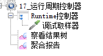
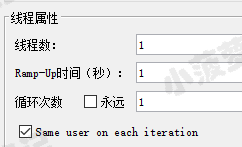
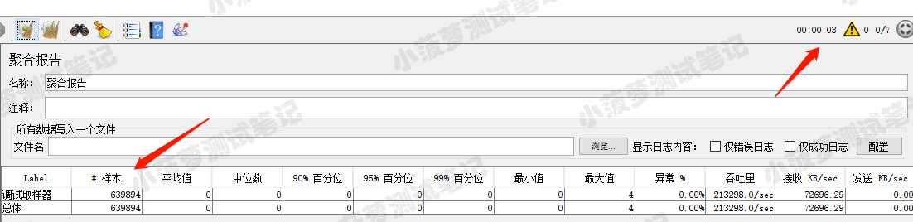
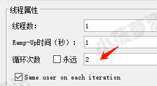
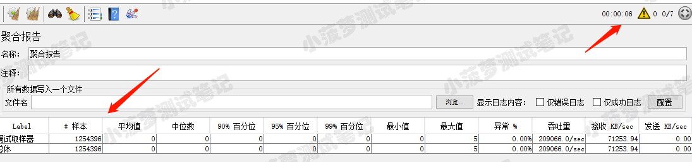

# 简单介绍
一种设置运行时间的控制器，它的效果就是使该控制器下的子项运行时间为【Runtime】中的数值（单位：s）

# Runtime Controller界面介绍
* Runtime：运行时长
* 和线程组的循环次数也有关系，如果是指定次数的话，总的运行时间 = 循环次数 * runtime
* 如果循环次数是永远，那么 Runtime 控制器下的子项也会永远运行
 

# 线程组单次循环的栗子
线程组结构树  

线程组属性  

聚合报告
  
线程组循环次数 = 1，runtime = 3s，所以线程组总运行时间 = 1 * 3s

 

# 线程组多次循环的栗子
线程组结构树  

线程组属性  

聚合报告

线程组循环次数 = 2，runtime = 3s，所以线程组总运行时间 = 2 * 3s