# 简单介绍
可以通过条件来控制是否运行其下面的测试元件（子元素）

**If 控制器界面介绍**
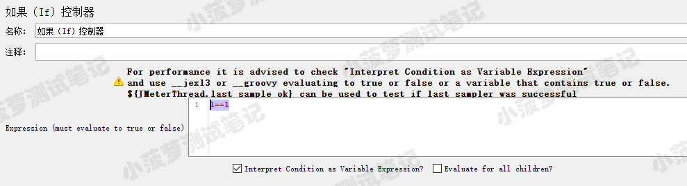

* Expression (must evaluate to true or false) ：表达式（值必须是 true 或 false )，也就是说，在右边文本框中输入的条件值必须是 true 或 false（默认情况下）
* Interpret Condition as Variable Expression?：默认勾选，将条件解释为变量表达式（需要使用 ${__jexl3 } 或 ${__groovy } 表达式）
* Evaluate for all children?：条件作用于每个子项（具体理解见后面的栗子说明）
 

**黄色感叹号那一段文字**

就是建议要选中 Interpret Condition as Variable Expression?，然后通过 ${__jexl3 } 或 ${__groovy } 表达式返回 true 或 false

 

**扩展**

如果要测试上一个样本（sampler）是否成功（code=200），则可以使用 ${JMeterThread.last_sample_ok} 

 

# 最简单的栗子
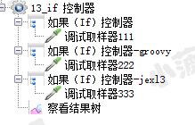

**第一个 if 控制器**
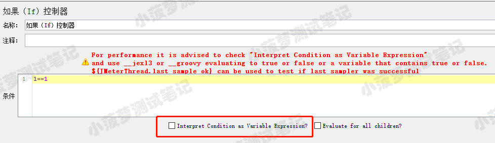

注意：如果取消选中 Interpret Condition as Variable Expression?，这可能会导致性能损失很大，并使测试的可扩展性降低，所以不推荐不勾选

 

**第二个使用 groovy 表达式的 if 控制器**
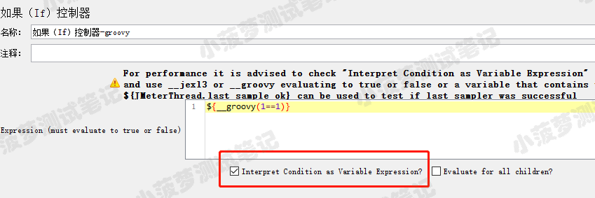

第三个使用 jexl3 表达式的 if 控制器
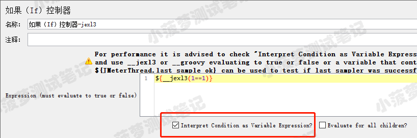

查看结果树  
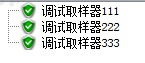

三个 if 控制器的表达式都是 true

 

# Expression 中使用变量的栗子
线程组结构树  
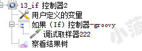

用户自定义变量

if 控制器
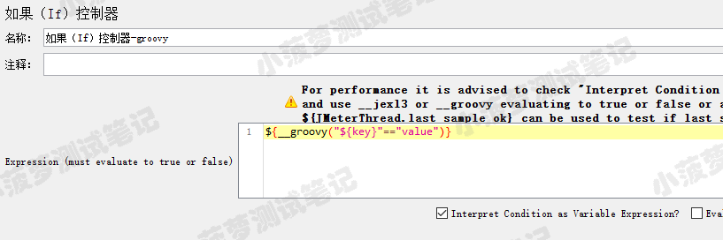
因为是字符串，所以要加双引号哦 "" 

# 勾选 Evaluate for all children? 的栗子
线程组结构树  
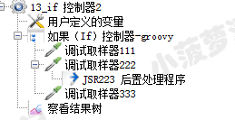

一共三个请求，第二个请求加了个后置处理器

用户自定义变量
 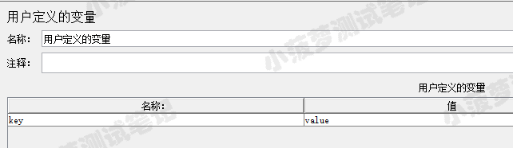

if 控制器
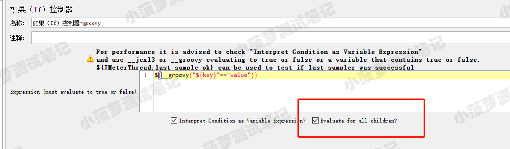

因为是字符串，所以要加双引号哦 ""

 

JSR223 后置处理器
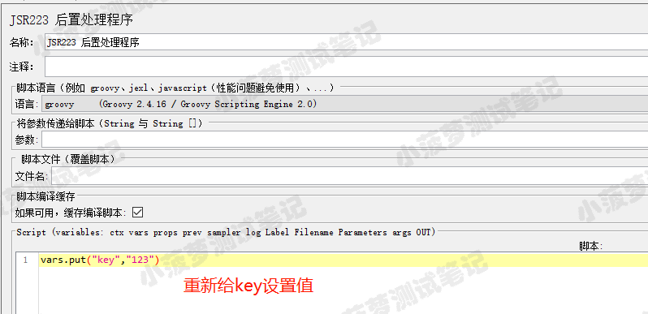

查看结果树   
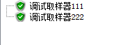

总结
勾选了 Evaluate for all children? 意味着它的每个子元素在运行前都会运行一次 if 控制器里面的条件表达式，看看是否还是 true，是的话就可以运行，false 就不运行