# 简单介绍
可以添加多个取样器（sampler），这样就把多个取样器当做一个完整的事务

# 事务控制器界面介绍
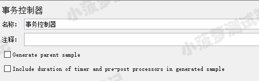

* Generate Parent Sample：如果选中，事务控制器将作为其他取样器的父级样本，否则事务控制器仅作为独立的样本
* Include duration of timer and pre-post processors in generated sample：是否在生成的样本中包括计时器，预处理和后处理的延迟时间

# 最简单的栗子（两项都不勾选）
线程组结构树  
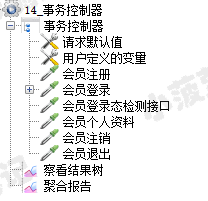  
一共 6 个接口

事务控制器

 

查看结果树  
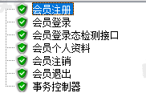

事务控制器和其他取样器是同级的

聚合报告
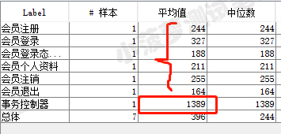

事务控制器的响应时间 = 其他接口的响应时间相加

# 勾选 Generate Parent Sample 的栗子
线程组结构树  
  
一共 6 个接口

事务控制器
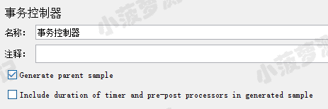

查看结果树  
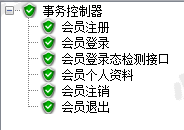  
事务控制器嵌套了其他接口

聚合报告
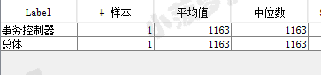  
只显示事务控制器的数据

 

# 勾选 Include duration.... 的栗子
线程组结构树  
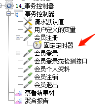  
一共 6 个接口，多了个定时器

 

事务控制器
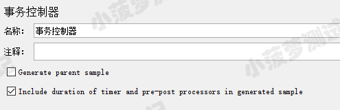

查看结果树  
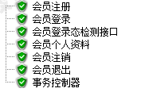
 

聚合报告
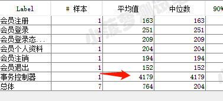  
可以看到，事务控制器的时间 = 其他接口的响应时间 + 定时器 + 前后置处理器的时间

 

# 当不勾选 include  duration of... 时，聚合报告是怎么样的呢
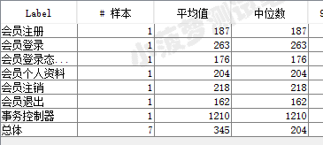  
事务控制器的时间 = 其他接口的响应时间