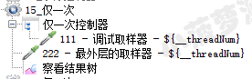
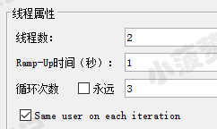
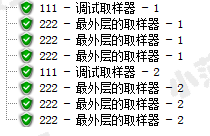
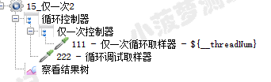
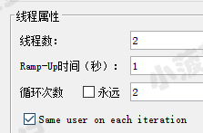
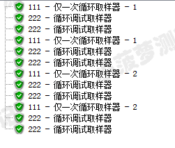

# 简单介绍
在每个线程内，该控制器下的内容只会被执行一遍，无论循环多少次，都只执行一遍

# 实际应用场景
对于需要登录的测试，可以将登录请求放置在此控制器中，因为每个线程只需要登录一次即可建立会话

# 最简单的栗子
线程组结构树  

线程组属性  

查看结果树  

仅在线程第一次循环会执行仅一次控制器里面的内容

# 加上循环控制器的栗子
线程组结构树  

线程组属性  

查看结果树  

* 仅在通过循环控制器的第一次迭代中执行控制器里面的内容
* 而循环控制器会执行 2 次，所以仅一次控制器也会执行 2 次