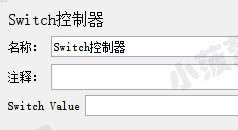
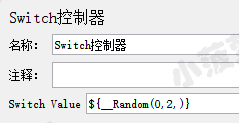
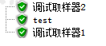
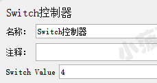
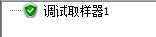
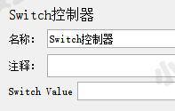
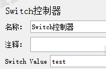
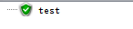
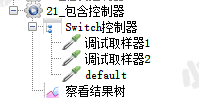
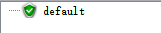

# 简单介绍
控制哪个子项将被执行，学过 java 的同学应该很清楚 switch 是做么该的

Switch 控制器界面介绍  

**Switch value**
* 既可以是下标值，也可以是名称
* 如果是下标值，则从 0 开始
* 如果下标值超出范围，它将运行第 0 个元素，因此它是数字情况的默认值
* 如果下标值值是空字符串，它还将运行第零个元素
* 如果该值是非数字（非空），则 Switch 控制器将查找具有相同名称的子项（区分大小写）
* 如果两个名称都不匹配，则选择名为 default（大小写无关）的元素
* 如果没有默认值 default，则不会选择任何元素，并且控制器将不会运行任何内容
 

# 有效下标值的栗子
线程组结构树  

后面的线程组基本都是这个，有变化再单独显示出来

switch 控制器  

通过随机产生 0-2 的数字来选择执行哪个 sampler

查看结果树  

跑了 3 次，每次都不一样

# 超出下标值范围的栗子
switch 控制器   

最大是 2，现在是 4，超出范围值

 

查看结果树  

只运行第一个子项

 

# 空字符串的栗子
switch 控制器  
  
不传值

查看结果树  

只运行第一个子项

# 名称的栗子
switch 控制器  

查看结果树  

名称匹配上了，所以只运行它

# default 的栗子
线程组结构树  
 

switch 控制器    

查看结果树  

# 不运行的栗子
switch 控制器  

不会执行子项