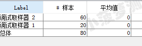
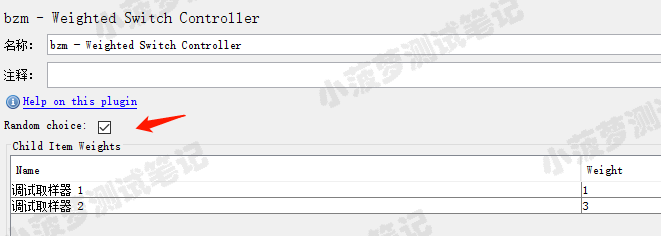

# 简单介绍
* 它能分配其子项目（Child Item）的权重，从而控制子项的执行概率
* 它是一个插件，需要额外下载哦
 

**插件下载地址**  
https://jmeter-plugins.org/ 

# 权重控制器界面介绍

* Random choice：勾选后，会随机选一个子项执行，不能保证子项执行的实际百分比等于预期值
* Child Item Weights：只要添加到该控制器下的子项（取样器、逻辑控制器）都会显示在这里
* weight：可以是任意数字，然后会按照比例去控制子项的执行概率 
 

# 简单的栗子
线程组结构树  

线程组属性  

一共循环 80 次 

权重控制器  

相当于 1:3 的比例来分配

查看聚合报告  

这个权重是精确控制的 

 

## 勾上 Random choice 的栗子

权重控制器

相当于 1:3 的比例来分配 

查看聚合报告  

这个权重是会有点偏差的，因为会随机选择一个子项执行