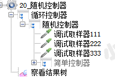
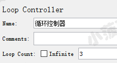
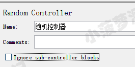
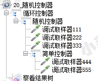
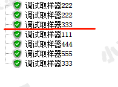
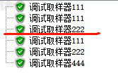

# 简单介绍
当该控制器下有多个子项时，每次循环会随机执行其中一个

# 实际应用
支持我们在做容量测试的时候，随机分配业务比例，最大程度的模拟用户场景

随机控制器界面介绍
* Ignore sub-controller block（忽略子控制器模块）：勾选后，随机控制器下的子控制器中的多个子项只会被执行一个（后面通过栗子验证）

# 简单栗子
线程组结构树  

循环控制器  

随机控制器  

查看结果树   

循环 3 次，每次会随机执行一个子项

 

# 勾选 Ignore sub-controller block 的栗子
线程组结构树  

循环控制器  

随机控制器  

先不勾选，看看结果  
查看结果树  

第二次输出的时候看到，会把简单控制器里面的所有子项都输出来

 

勾选 Ignore sub-controller block 的输出结果  

若随机到简单控制器，则只会随机执行其中一个子项