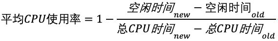

## CPU 使用率
CPU 使用率：除了空闲时间外的其他时间占总 CPU 时间的百分比。

性能工具一般都会取间隔一段时间（比如 3 秒）的两次值，作差后，再计算出这段时间内的平均 CPU 使用率，即

## CPU 时间
Linux 将 CPU 时间分为很短的时间片，通过调度器轮流分配给各个任务使用。

    # 只保留各个CPU的数据
    $ cat /proc/stat | grep ^cpu
    cpu  280580 7407 286084 172900810 83602 0 583 0 0 0
    cpu0 144745 4181 176701 86423902 52076 0 301 0 0 0
    cpu1 135834 3226 109383 86476907 31525 0 282 0 0 0

第一列是 CPU 编号，如 cpu0、cpu1 。第一行没有编号的 cpu ，表示的是所有 CPU 的累加。

其他列表示不同场景下 CPU 的累加节拍数，它的单位是 USER_HZ，也就是 10 ms。

* user（通常缩写为 us），代表用户态 CPU 时间。注意，它不包括下面的 nice 时间，但包括了 guest 时间。
* nice（通常缩写为 ni），代表低优先级用户态 CPU 时间，也就是进程的 nice 值被调整为 1-19 之间时的 CPU 时间。这里注意，nice 可取值范围是 -20 到 19，数值越大，优先级反而越低。
* system（通常缩写为 sys），代表内核态 CPU 时间。
* idle（通常缩写为 id），代表空闲时间。注意，它不包括等待 I/O 的时间（iowait）。
* iowait（通常缩写为 wa），代表等待 I/O 的 CPU 时间。
* irq（通常缩写为 hi），代表处理硬中断的 CPU 时间。
* softirq（通常缩写为 si），代表处理软中断的 CPU 时间。
* steal（通常缩写为 st），代表当系统运行在虚拟机中的时候，被其他虚拟机占用的 CPU 时间。
* guest（通常缩写为 guest），代表通过虚拟化运行其他操作系统的时间，也就是运行虚拟机的 CPU 时间。
* guest_nice（通常缩写为 gnice），代表以低优先级运行虚拟机的时间。

## 查看 CPU 使用率
* per-CPU utilization：每个 CPU 的使用率，使用 mpstat -P ALL 1
* Per-process CPU utilization：每个进程的 CPU 使用情况，使用 top、pidstat 1 等。

**top 命令同时展示了以上两种 CPU 指标，还展示了内存使用情况，很强！**