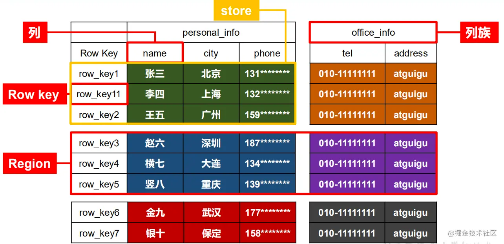
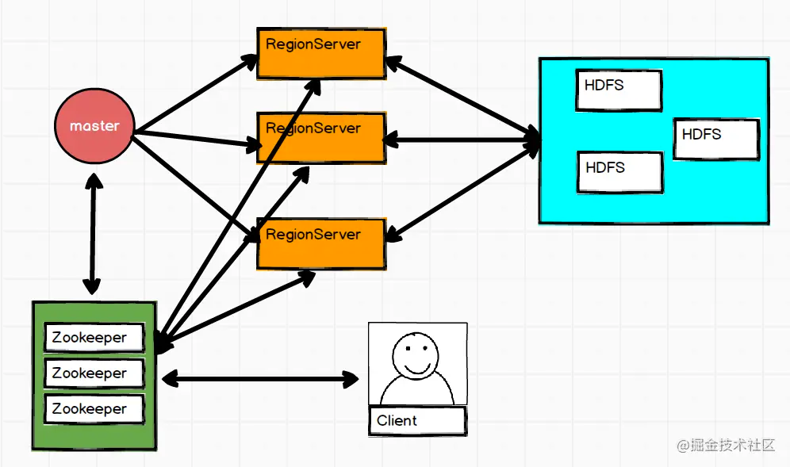
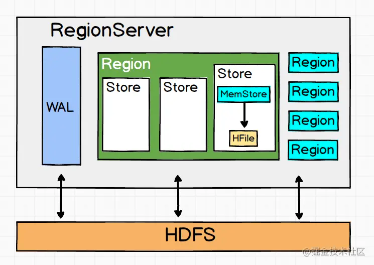
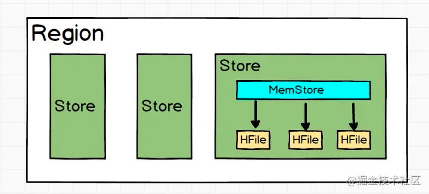
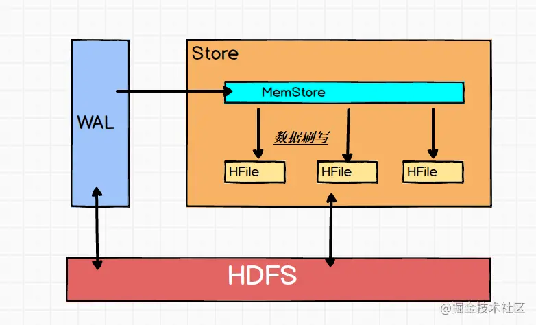
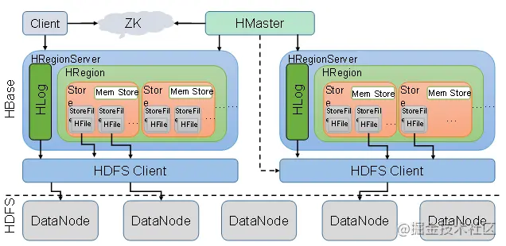

#Hbase简介
Hbase是Hadoop Database的简称。 Hbase是分布式、面向列族的开源数据库。
Hbase是一个通过大量廉价的机器解决海量数据的高速存储和读取的分布式数据库解决方案。
#Hbase特点
*海量存储 

    PB级别

*列式存储

    Hbas是根据列族来存储的，创建表的时候必须先指定好列族

*高并发

    高并发下，单个io的延时不会下降很多

*稀疏

    在列族中，可指定任意多的列；在列数据为空时，不会占用存储空间

*极易扩展

    1.基于RegionServer扩展
    2.基于HDFS扩展

#Hbase逻辑结构

从逻辑图上，我们将相同rowKey的写在同一行
##列族
列族我将它理解为列的分类，即将属性相近的几个列划为同一个列族。创建表的时候必须就指定
要哪些列族，而列无需指定，因为列可增减变化的。列族存在的意义是：HBase会把相同列族的
列尽量放在同一台机器上，所以说想把某几个列放在一台服务器上，只需要给他们定义相同的列族。
##行
相同rowKey为一行
##rowKey
相当于主键
##Region
Region就是一段数据的集合。之前提到过高表的概念，把高表进行水平切分，假设分成两部分，
那么这就形成了两个Region。注意一下Region的几个特性：

Region不能跨服务器，一个RegionServer可以有多个Region。
当数据量大的时候，HBase会拆分Region。 当HBase在进行负载均衡的时候，
也有可能从一台RegionServer上把Region移动到另一服务器的RegionServer上。
Region是基于HDFS的，它的所有数据存取操作都是调用HDFS客户端完成的。
##RegionServer
RegionServer就是存放Region的容器，直观上说就是服务器上的一个服务。负责管理维护Region。

#Hbase物理存储

如图所示，重新定义下几个概念
##列
相同的列族和列修饰符为一列。例如 info：name，info：age。
##TimeStamp
时间戳，用于标识数据的不同版本（version），读取数据的时候一般只拿
出数据的Type符合，时间戳最新的数据。HBase中通过Type来标识数据是否可用。
因为HDFS不支持改。
##cell
单元格，由{rowkey, column Family：column Qualifier, time Stamp} 唯一确定的单元。
cell 中的数据是没有类型的，全部是字节码形式存储。

#Hbase架构

##client
client提供了访问Hbase接口
##zookeeper
1.保证master高可用

2.监控RegionServer状态

3.元数据的入口以及集群配置的维护等工作
##master
1.为RegionServer分配Region

2.维护整个集群的负载均衡

3.维护集群的元数据信息

4.发现失效的Region，并将失效的Region分配到正常的RegionServer上

5.当RegionSever失效的时候，协调对应Hlog的拆分
##RegionServer
1.管理master为其分配的Region

2.处理来自客户端的读写请求

3.负责和底层HDFS的交互，存储数据到HDFS

4.负责Region变大以后的拆分

5.负责Storefile的合并工作

RegionServer的内部架构如下：

有上图可知，RegionServer包含了

1.一个WAL

    WAL(Write-Ahead Log)为预写入日志。
    *当数据到达Region时，先写入到WAL中，然后写入MemStore中。
        -优点：解决宕机之后的操作恢复问题
        -缺点：性能下降
    *异步写入：为解决频繁的资源消耗，引入异步写入，即间隔N秒，写入一次
    *
2.多个Region
    
    Region是数据库的一部分，每一个Region都有起始的rowkey和结束的
    rowkey，代表了它存储的row的范围。
##Region

一个Region包含 多个Store，
一个Store就是对应一个列族的数据，如图就有三个列族。
再从最后一个Store中我们又可以看出，Store是由MemStore和HFile组成的。

##Store

*MemStore

    每个Store都有一个MemStore实例。数据写入到WAL之后就会被放入
    MemStore中。MemStore是内存的存储对象，只有到达一定的时机才
    会被刷写到HFile中去。
*HFile
    
    在Store中有多个HFile,每次刷写都会形成一个HFile文件落盘在HDFS
    上。HFile直接跟HDFS打交道，它是数据存储的实体。
这里有个问题：数据进入HFile之前就已经被持久化了，为什么还要放入MemStore？

这是因为HDFS支持文件的创建、追加、删除，但是不能修改。对于一个数据库来说，
数据的顺序是非常重要的。第一次WAL的持久化是为了保证数据的安全性，无序的。
再读取到MemStore中，是为了排序后存储。所以MemStore的意义在于维持数据按照
rowkey的字典序排列，而不是做一个缓存提高写入效率。

##HDFS
1.提供元数据和表数据的底层分布式存储服务

2.数据多副本，保证的高可靠和高可用性

##补一个Hbase架构解析图

