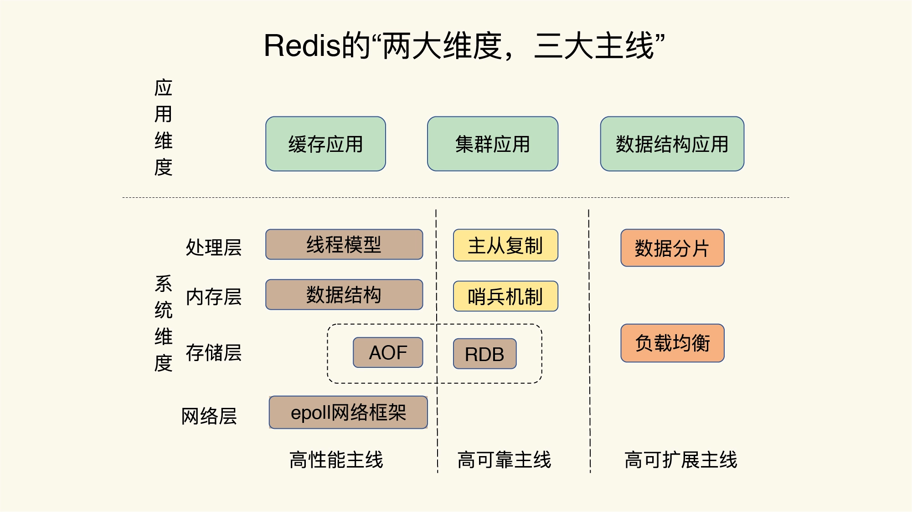
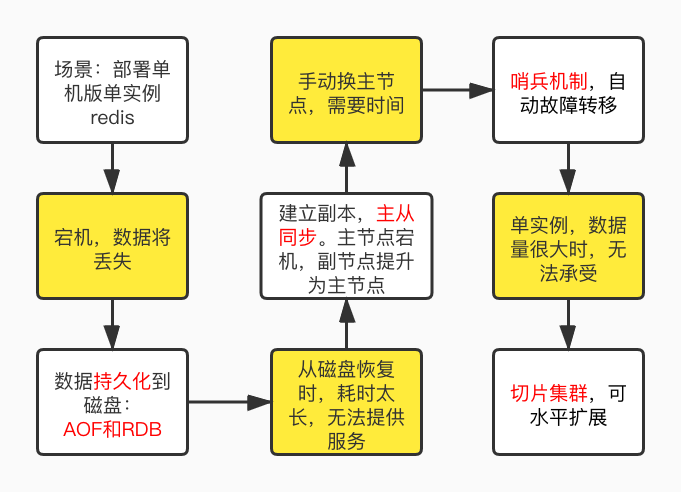
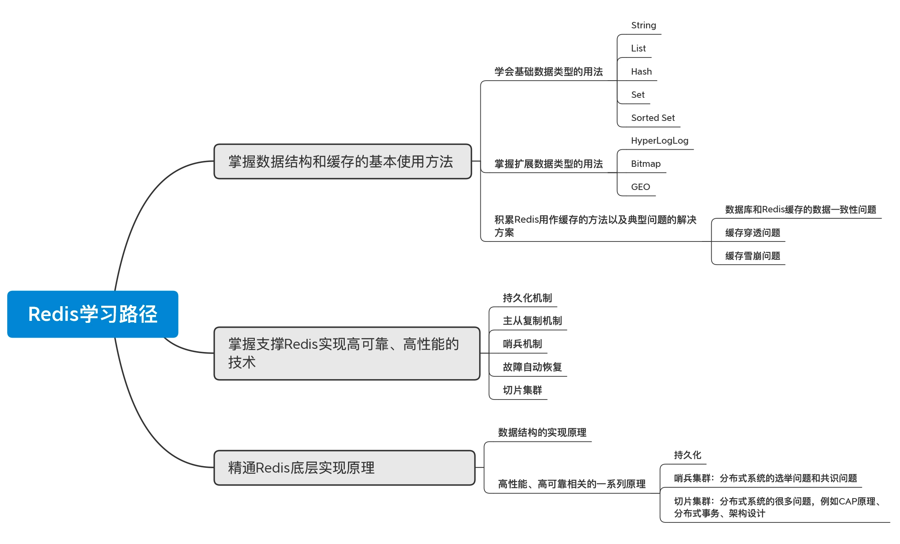

# Redis学习路径

借鉴别人走过的弯路和踩过的坑，我们将学习redis的路径总结如下：
1. 掌握数据结构基本使用方法；
2. 掌握支撑Redis实现高可靠、高性能的技术；
3. 精通 Redis 底层实现原理

下面详细介绍下每一步需要掌握的知识。
## 一. 掌握数据结构基本使用方法
为快速上手redis，我们需要
1. 学会基础数据类型的用法；
2. 掌握扩展数据类型的用法；
3. 积累一些 Redis 用作缓存的方法以及典型问题的解决方案。

redis的基础数据类型包括了：String、List、Hash、Set、Sorted Set；
扩展数据类型有HyperLogLog、Bitmap 和 GEO。挖掘这些数据类型的使用方法
和使用场景，如何借此实现我们的业务模型。

redis作为缓存时的经典问题，如数据一致性问题、缓存穿透问题、缓存雪崩问题。
学习常见的应对策略。

## 二. 掌握支撑Redis实现高可靠、高性能的技术
一个优秀软件，总是符合"高性能，高可靠，高可扩展"，围绕三高主线学习，可让
我们从全局上把控redis。学习redis的全景图如下：

### 1. 高可靠
为何要高可靠性？先从一个最简单的单机版 Redis 说起。

假设我们只部署一个 Redis 实例，然后把业务数据都存储在这个实例中，
而 Redis 只把数据存储在内存中，如果这个 Redis 实例故障宕机了，
就意味着，我们的业务数据就全部丢失了，这显然是不能接受的。

那该如何处理呢？下面这个图将带你了解高可靠面临的问题和解决方案

### 2. 高性能
（略）
### 3. 高可扩展
（略）

## 三. 精通Redis底层实现原理
理解各种数据类型的底层原理；

需要掌握跟高性能、高可靠相关的一系列原理，主要就是持久化、主从同步、故障转移、切片集群是如何做的

## 四. 总结
