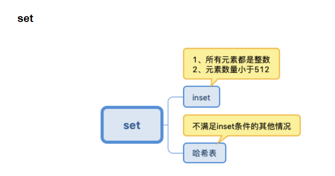
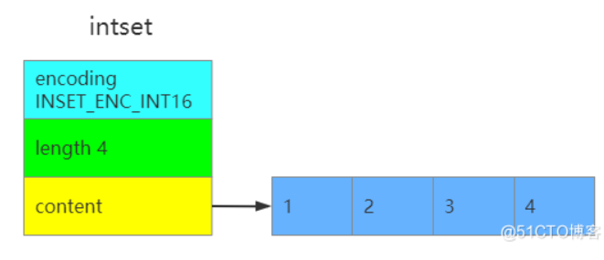

redis的集合对象set底层使用了intset和hashtable两种数据结构存储。
使用intset存储必须满足下面两个条件，否则使用hashtable，条件如下：

* 结合对象保存的所有元素都是整数值
* 集合对象保存的元素数量不超过512个

* length：数组content的长度
* encoding：共有三种，INTSET_ENC_INT16、INSET_ENC_INT32和INSET_ENC_INT64三种，分别对应不同的范围。
  * INTSET_ENC_INT16：16位，2个字节，表示范围-32,768~32,767
  * INSET_ENC_INT32：32位，4个字节，表示范 //围-2,147,483,648~2,147,483,647
  * INSET_ENC_INT64：64位，8个字节，表示范围-9,223,372,036,854,775,808~9,223,372,036,854,775,807 
* 数组contents：真正存储数据的地方，数组是按照从小到大有序排列的，并且不包含任何重复项
* 
