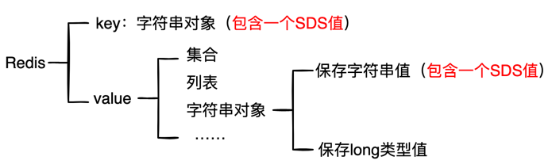

# Redis之SDS

SDS(Simple Dynamic String，简单动态字符串)，是Redis底层所用的字符串表示。

## 一. SDS的作用
1. 实现字符串对象
2. 替代char*类型

由于char*类型无法高效的支持追加、长度计算等操作，所以在Redis中，大部分情况会用SDS而不是
char*来表示字符串。

## 二. SDS结构

* buf：字节数组，保存实际数据。在数组最后会加“\0”，额外占用 1 个字节。
* len：占 4 个字节，表示 buf 的已用长度。
* alloc：占个 4 字节，表示 buf 的实际分配长度。

### 高效的字符串长度计算
由SDS结构可知，计算字符串长度的时间复杂度只需θ(1)
### 二进制安全

    二进制安全：通俗的讲，C 语言中，用 “\0” 表示字符串的结束，如果字符串本身就有
    “\0” 字符，字符串就会被截断，即非二进制安全；若通过某种机制，保证读写字符串时
    不损害其内容，则是二进制安全。

在 C 语言获取一个字符串长度，会逐个字符遍历，直到遇到\0为止。
在 SDS 中，是使用 len 属性而不是空字符串来判断字符串是否结束。所以二进制安全
### 防止内存溢出
在C语言中，使用 strcat 拼接两个字符串时，一定要判断第一个字符串后面是否有足够的内存空间；如果不够了，就得手动扩容，这一系列判断 + 扩容操作需要开发人员自己去完成。
否则会发生内存泄漏。  
而 Redis SDS 提供的所有修改字符串的 API 中，都会判断修改之后是否会有内存溢出，SDS 会帮我们处理内存扩容，无需我们开发人员手动判断 + 扩容。

### 高效的追加操作
在C字符串中，增长或缩短都需要对内存重新分配。增长操作需要扩充底层数组的空间，以免内存溢出；
缩短操作要释放空间，以免内存泄漏。  
内存重新分配是个耗时的过程，Redis的SDS通过冗余设计，可减少在追加操作时的内存重新分配。
#### 空间预分配
* 未使用空间足够：直接使用未使用空间，无需内存分配
* 未使用空间不足：
  * 如果对 SDS 进行修改之后，SDS 的长度将小于 1MB，那么程序分配和 len 属性同样大小的未使用空间。
  * 如果对 SDS 进行修改之后，SDS 的长度将大于等于 1MB，那么程序会分配 1MB 的未使用空间。
#### 惰性空间释放
当 SDS 的 API 需要缩短 SDS 保存的字符串时，程序并不立即使用内存重分配来回收缩短后多出来的字节。
可以调用相关api来释放。