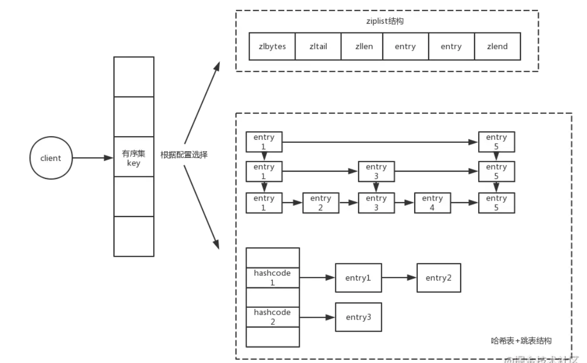
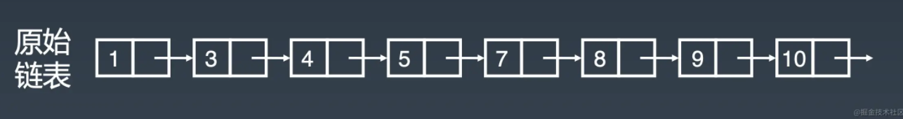
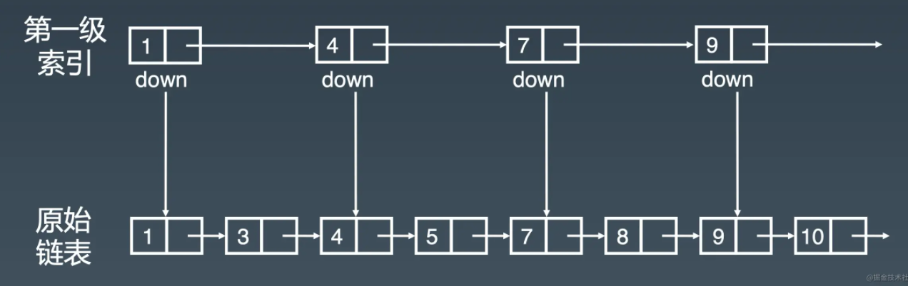
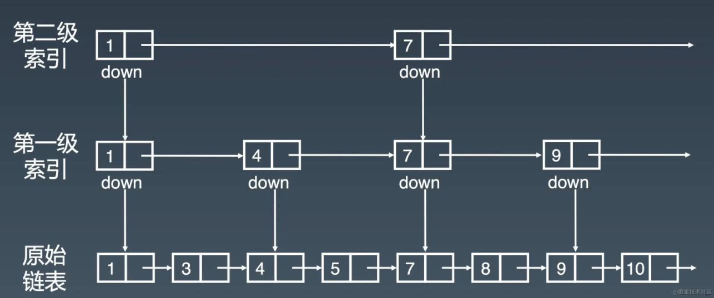
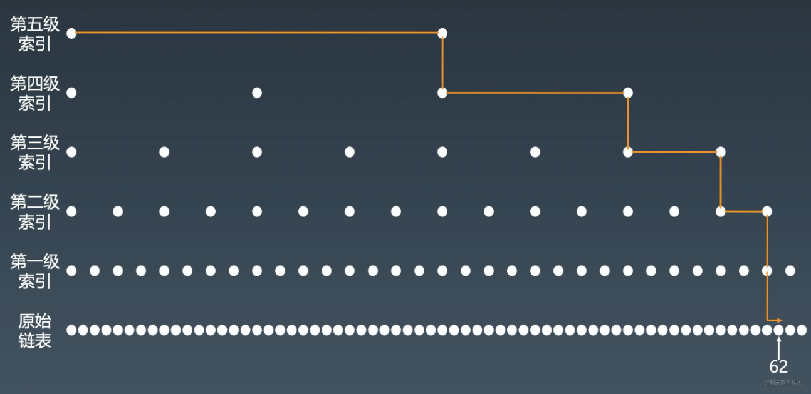
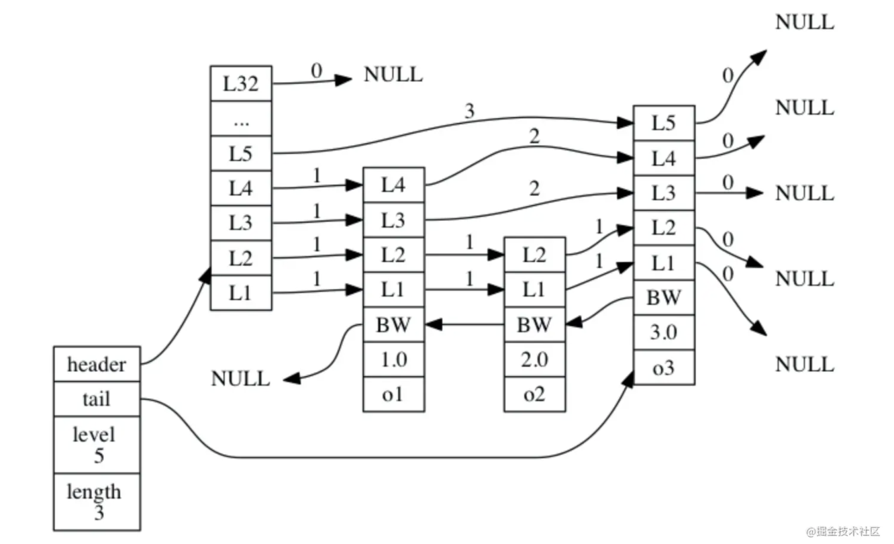
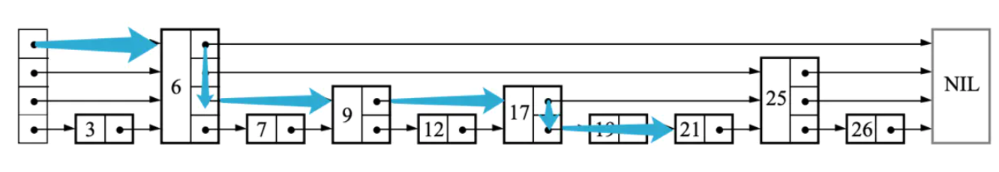

SortedSet底层数据结构有两种，zset和ziplist。

同时满足以下条件，用ziplist，否则用zset。
* 保存的元素数量小于128个
* 每个元素的长度小于64字节

当然这两个参数可配置

    zset-max-ziplist-entries 128
    zset-max-ziplist-value 64

## zset
    typedef struct zset {
        dict *dict;
        zskiplist *zsl;
    } zset
zset是字典+跳表，字典保存了数据到分数的关系（应该是分数作为key，如果能保证每个分数都不一样），跳表维护了分数在链表的关系，是排序的关键。
例如：字典的，张三—>80, 李四->90。
### 跳表
跳表是实现二分查找的有序链表，通过建立多级索引。下面的示例可建立感性的认识。

为什么采用跳表？

数组：查询快，但设计插入删除时，涉及内存扩展释放；  
有序链表：查询的时间复杂度高，为o(n)  
Redis使用跳表而不是平衡树的原因：
* 平衡二叉树实现复杂，特别是插入删除有严格的旋转操作
* 跳表实现简单，查询高效，插入删除简单
* 按区间查找数据，平衡树效率低于跳表，跳表可以在 O(logn)
时间复杂度定位区间的起点，然后在原始链表中顺序向后查询

#### Redis中跳表的结构

Redis的跳表由zskiplistNode和zskiplist组成。
图片最左边为zskiplist,4个属性：
* header：指向表头节点
* tail：指向表尾节点
* level：各节点中的最大层数（表头节点的层数不计算在内）
* length：节点数量（表头节点的层数不计算在内）

右边四个zskiplistNode,属性有：
* level：如图中的L1、L2、L3等，每层有两个属性：前进指针和跨度。前进指针指向了在表尾方向的其他节点，跨度记录了前进指针指向的节点和当前节点的距离。
* 后退（backward）指针：图中的BW，指向位于当前节点的前一个节点。
* 分值（score）：在跳跃表中，节点按各自所保存的分值从小到大排列。
* 成员对象（obj）：一个指针， 它指向一个字符串对象

#### 查询
* 如果当前节点的下一个节点包含的值比目标元素值小，则继续向右查找。
* 如果当前节点的下一个节点的值比目标值大，就转到下一层找。重复向右和向下的操作，直到找到目标值。

比如要查找21，过程如下：

跳表实现了类似二分查找的功能，平均时间复杂度为O(logn)

## ziplist
压缩列表是由一系列特殊编码的连续内存块组成的顺序型数据结构，一个压缩列表可以包含任意多个节点（entry），每个节点可以保存一个字节数组 或者一个整数值 。

