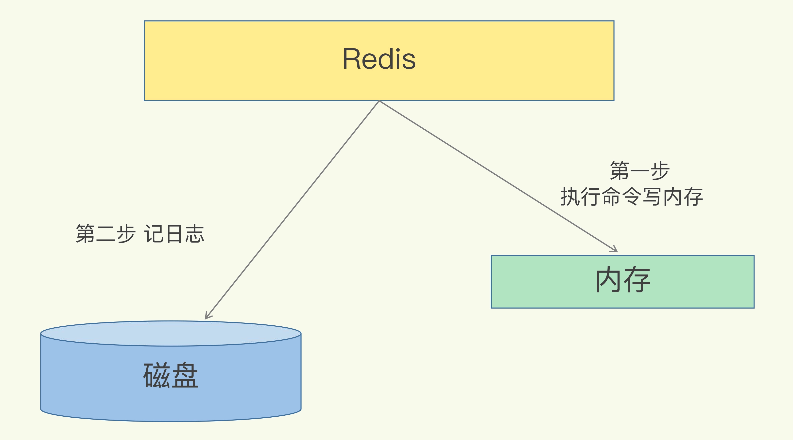
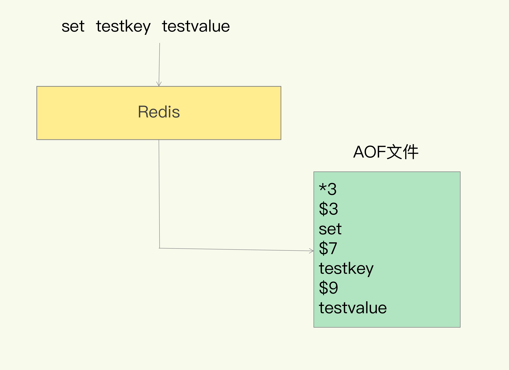
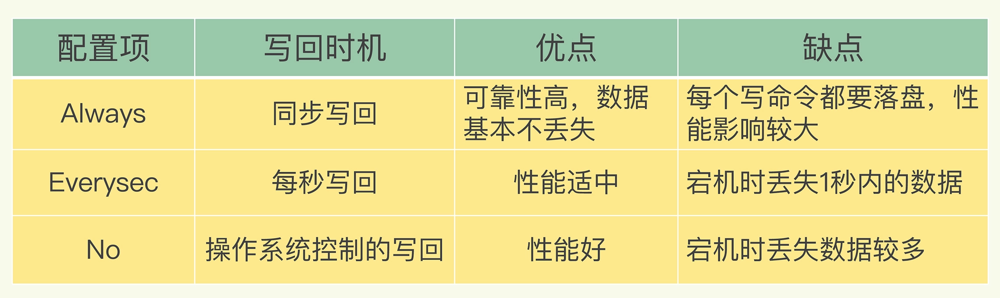
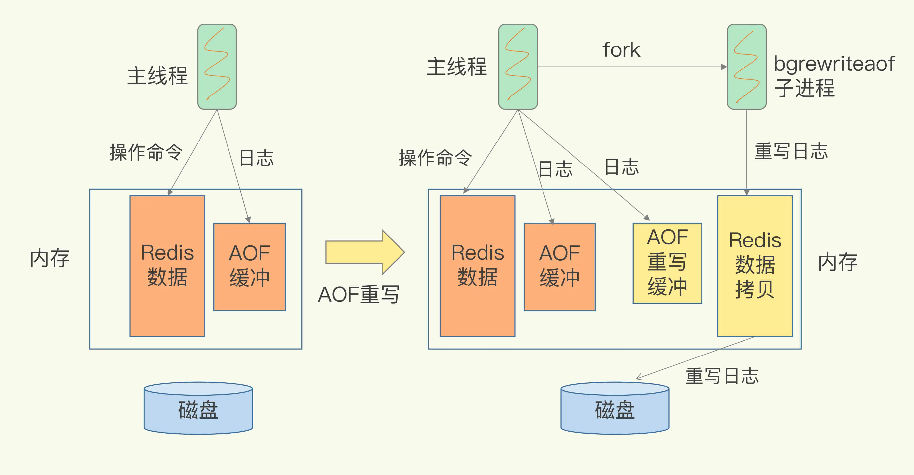

# Redis高可靠之AOF篇
Redis为解决宕机数据丢失问题，提供了AOF日志机制，实现数据持久化，用于数据恢复。

## 一. AOF是什么
AOF是以文本形式保存日志的文件。  

我们知道Hbase时写前日志（WAL），即先写入日志，再做数据操作。Redis相反，先操作数据，再写日志。如下图：

为什么要采用后写呢？先要了解AOF记录了什么内容。  

    AOF里记录的是 Redis 收到的每一条命令。  

以 Redis 收到“set testkey testvalue”命令后记录的日志为例。AOF文件
内容如下图所示，其中：  
* “*3”：当前命令有三个部分，每部分都是由 “$+数字”开头，后面紧跟着具体
的命令、键或值。  
* “$+数字”：表示这部分中的 命令、键或值一共有多少字节。 例如，“$3 set”表示这部分有 3 个字节，也就 是“set”命令。

那么，写后日志有何好处
1. Redis没有做语法检查，可避免记录到错误的命令
2. 不会阻塞当前写操作  

那有何风险
1. 刚执行完命令就宕机，来不及写入日志
2. AOF虽然避免了对当前命令的阻塞，但可能会给下一个操作带来阻塞风险  

如果能控制AOF写回磁盘时机，那么就能控制第二个风险。

## 二. 写回策略
写回策略是指控制一个写命令执行完后AOF日志写回磁盘的时机。

**Always**，同步写回：每个写命令执行完，立马同步地将日志写回磁盘；  
**Everysec**，每秒写回：每个写命令执行完，只是先把日志写到 AOF 文件的内存缓冲区，每隔一秒把缓冲区中的内容写入磁盘；  
**No**，操作系统控制的写回：每个写命令执行完，只是先把日志写到 AOF 文件的内存缓冲区，由操作系统决定何时将缓冲区内容写回磁盘。  

下图总结了三种策略的优劣

简单的说，要求高性能，选择Always策略；要求高可靠，选择
No策略；在性能和可靠性之间折中，选择EverySec策略。

除了上述影响性能的因素，AOF文件太大，也会影响性能，为何？
1. 文件太大，往里面追加命令，效率会降低
2. 发生宕机时，如果日志里的命令太多，所有的命令要被一一执行用于故障恢复，这样整个恢复过程会非常慢
3. 最后文件系统本身对文件大小也会限制 

那如何控制AOF文件大小？解决方案是**AOF重写机制**
## 三. AOF重写机制
当一个键值对被反复修改，AOF文 件会记录相应的多条命令。在重写时，会根据这个键值对当前的最新状态，
为它生成对应的写入命令。所以重写后就剩一条写命令。这样就减少了AOF日志的大小。

### 重写过程
AOF重写毕竟是要将整个数据库的最新数据的操作日志都写回磁盘，很耗时。所以用子进程完成重写

    AOF日志由主线程写回，而重写过程是由后台子进程bgrewriteaof完成，
    这也是为了避免阻塞主线程，导致数据库性能下降

可以由下图来描述重写过程

1. fork子进程：每次执行重写时，主线程fork出后台的bgrewriteaof子进程。
主线程的内存会拷贝一份给子进程，里面就包含了数据库的最新数据。
2. 两处日志：  
   * 主线程未被阻塞，所以Redis会把当前操作写入AOF日志的缓冲区，此为第一处日志；
   * 当前操作也会写入新的重写日志的缓冲区。等到拷贝数据的所有操作记录重写完成后，重写日志记录的这些最新操作也会写入新的 AOF 文件，以保证数据库最新状态的记录。

