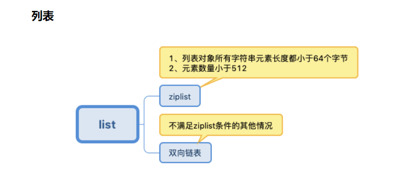
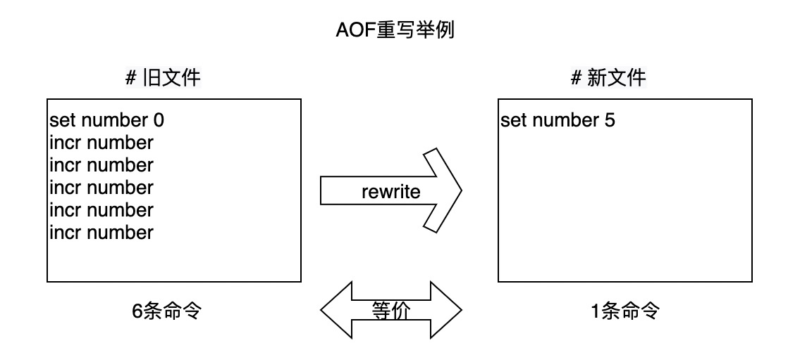

# Redis高可靠之AOF篇
Redis为解决宕机数据丢失问题，提供了AOF日志机制，实现数据持久化，用于数据恢复。

## 一. AOF基本知识
### AOF定义
AOF是以文本形式，记录了每个键值对的操作命令，以便在需要时恢复数据。  

以“set testkey testvalue”为例。AOF文件
内容如图所示，其中：  
* “*3”：当前命令有三个部分，每部分都是由 “$+数字”开头，后面紧跟着具体
的命令、键或值。  
* “$+数字”：表示这部分中的 命令、键或值一共有多少字节。

### AOF是写后日志

Redis先执行命令，再写日志
好处：
1. Redis没有做语法检查，可避免记录到错误的命令
2. 不会阻塞当前写操作  

风险：
1. 刚执行完命令就宕机，来不及写入日志
2. 可能会给下一个操作带来阻塞风险  

### AOF缓冲区
文件IO是操作系统的性能短板，Redis的追加操作只是把数据写入缓冲区（aof_buf）,从缓冲区
写入磁盘有几种策略选择。

## 持久化流程

主要有几个过程：命令追加、文件写入和同步、AOF重写、数据重新加载

### 命令追加
追加的命令先写道缓存区aof_buf，如果此时正在AOF重写，这些命令还会追加到重写缓冲区aof_rewrite_buffer。

### 文件写入和同步
从流程图可看出，redis在将aof_buf写入内核缓存区后，会有三种策略来决定何时将内核缓冲区的数据
写入磁盘：
**Always**，同步写回：每个写命令执行完，立马同步地将日志写回磁盘；  
**Everysec**，每秒写回：每个写命令执行完，只是先把日志写到 AOF 文件的内存缓冲区，每隔一秒把缓冲区中的内容写入磁盘；  
**No**，操作系统控制的写回：每个写命令执行完，只是先把日志写到 AOF 文件的内存缓冲区，由操作系统决定何时将缓冲区内容写回磁盘。  

下图总结了三种策略的优劣

除了上述影响性能的因素，AOF文件太大，也会影响性能，为何？
1. 文件太大，往里面追加命令，效率会降低
2. 发生宕机时，如果日志里的命令太多，所有的命令要被一一执行用于故障恢复，这样整个恢复过程会非常慢
3. 最后文件系统本身对文件大小也会限制 

### AOF重写

当一个键值对被反复修改，重写只记录最新状态对应的写操作。

### 重写过程
AOF重写毕竟是要将整个数据库的最新数据的操作日志都写回磁盘，很耗时。所以用子进程完成重写

    AOF日志由主线程写回，而重写过程是由后台子进程bgrewriteaof完成，
    这也是为了避免阻塞主线程，导致数据库性能下降

可以由下图来描述重写过程

1. fork子进程：每次执行重写时，主线程fork出后台的bgrewriteaof子进程。
主线程的内存会拷贝一份给子进程，里面就包含了数据库的最新数据。
2. 两处日志：  
   * 主线程未被阻塞，所以Redis会把当前操作写入AOF日志的缓冲区，此为第一处日志；
   * 当前操作也会写入新的重写日志的缓冲区。等到拷贝数据的所有操作记录重写完成后，重写日志记录的这些最新操作也会写入新的 AOF 文件，以保证数据库最新状态的记录。

