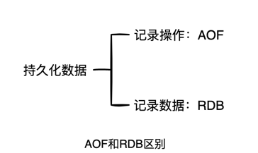
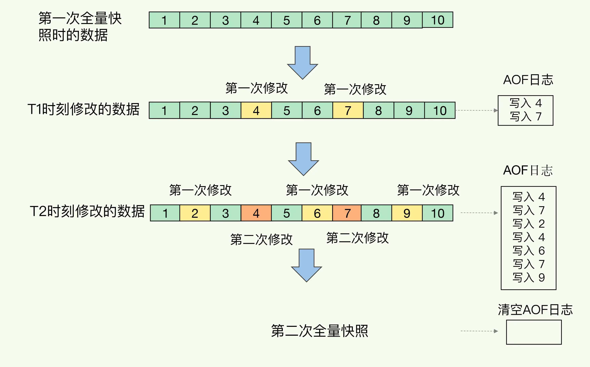
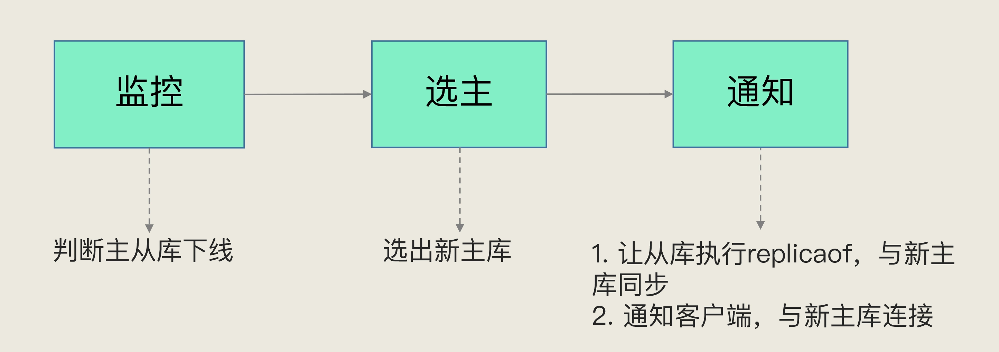
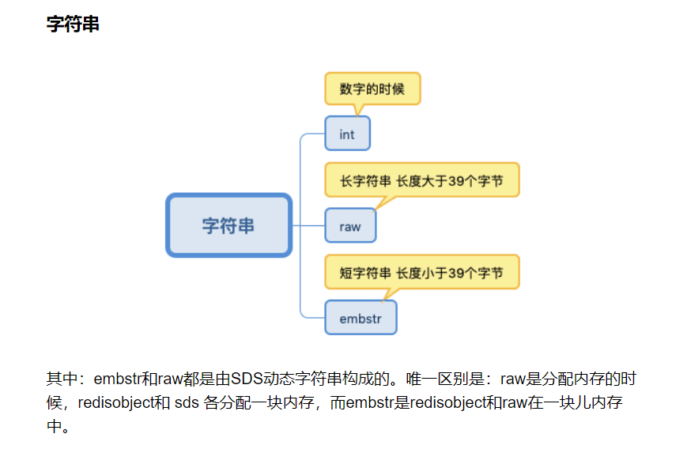

# Redis高可靠之RDB篇

        
    Redis会将内存中某一个时刻的状态，以文件形式记录到磁盘中，即RDB文件，是二进制文件。

## 一. 全量快照
Redis执行全量快照，当全量数据很多，RDB文件很大，写入磁盘会很耗时。  
解决方案是用子进程，防止阻塞主进程。  
Redis 提供了两个命令来生成 RDB 文件，分别是 save 和 bgsave。

    save：在主线程中执行，会导致阻塞；
    bgsave：创建一个子进程，专门用于写入RDB文件，这也是 Redis RDB 文件生成的默认配置。

## 二. 快照期间，数据发生修改怎么办?
借助操作系统提供的**写时复制技术**（Copy-On-Write, COW）。

由上图知，如果快照期间，主线程要修改某块数据，先生成该数据副本，主线程在副本修改，bgsave将主本数据写入
RDB文件

## 三. 做快照的频次问题
快照间隔太长，宕机了易丢数据；太短有性能问题

    1. 写磁盘时，多个快照竞争有限的磁盘带宽。
    2. fork这个创建过程本身会阻塞主线程，而且主线程的内存越大，阻塞时间越长。

那怎么解决呢？  

混合使用AOF日志和内存快照：内存快照以一定的频率执行，在两次快照期间的数据修改，用AOF记录。  

## 四. 整体流程

几点说明：
1. RDB持久化的触发方式两种：自动和手动
2. 自动触发场景有
   1. serverCron中save m n配置规则自动触发； 
   2. 主从全量同步时，主节点发送rdb给从节点，主节点会出发bgsave； 
   3. 执行debug reload命令重新加载redis时； 
   4. 未开启AOF时执行shutdown命令，自动执行bgsave；

以serverCron为例，讲解流程：
1. save规则检查
   1. save m n的意思是：m秒内有n条写入就触发一次快照，即备份一次。
   2. save参数可以配置多组，满足在不同条件的备份要求。
   3. 如果需要关闭RDB的自动备份策略，可以使用save ""。
2. rdbSaveBackground  
该函数的主要工作是fork子进程。具体逻辑如下：
   1. 如果调用方是父进程，则fork子进程，保存子进程信息后直接返回。 
   2. 如果调用方是子进程，则调用rdbSave执行RDB持久化逻辑。
3. rdbSave  
该方法是真正执行持久化的函数，具体逻辑见图

