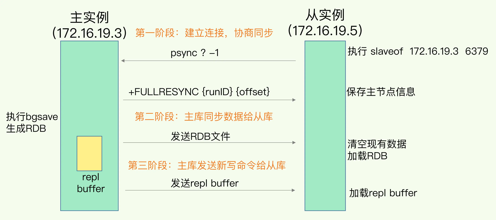
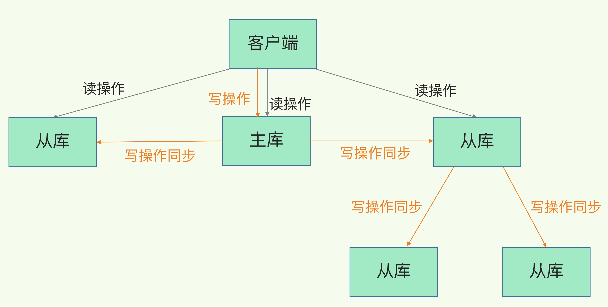
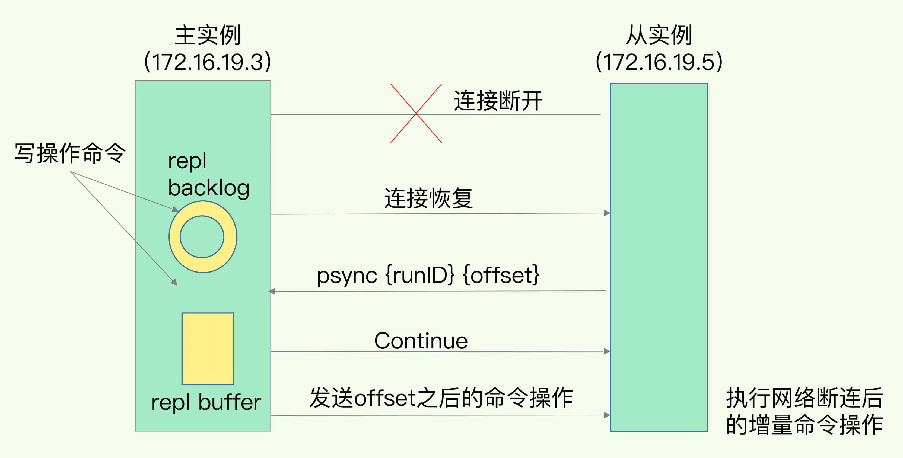

# Redis高可靠之主从同步
前面介绍的AOF和RDB，是为了解决数据丢失问题，但没有解决如何减少服务中断。如何解决呢？
容易想到的是增加实例，多实例保存一份数据，提供服务的实例挂了，其他实例代替即可。

既然有多实例，那就要分主从库，需要解决主从同步，网络中断，主库切换等问题。
## 一. 首次同步-全量复制
1. 用replicaof命令形成主从关系  
现在有实例 1（ip：172.16.19.3）和实例 2（ip：172.16.19.5），在实例2上执行命令【replicaof 172.16.19.3 6379】后，实例2就变成了实例1的从库，并从实例1上复制数据。

2. 首次同步的三阶段  
整个阶段如下图所示

### 第一阶段：建立连接 
从库给主库发送 psync 命令，表示要进行数据同步，主库根据这个命令的参数来启动复制。psync 命令包含了主库的 runID 和复制进度 offset 两个参数。  
* runID，是每个 Redis 实例启动时都会自动生成的一个随机 ID，用来唯一标记这个实例。当从库和主库第一次复制时，因为不知道主库的 runID，所以将 runID 设为“？”。  
* offset，此时设为 -1，表示第一次复制。  

主库收到 psync 命令后，会用 FULLRESYNC 响应命令带上两个参数：主库 runID 和主库目前的复制进度 offset，返回给从库。从库收到响应后，会记录下这两个参数。  
这里有个地方需要注意，FULLRESYNC 响应表示第一次复制采用的全量复制，也就是说，主库会把当前所有的数据都复制给从库。

### 第二阶段：同步数据
主库执行 bgsave 命令，生成 RDB 文件，接着将文件发给从库。从库接收到 RDB 文件后，会先清空当前数据库，然后加载 RDB 文件。

主从同步过程中，主库仍可正常接收新的请求，这些请求中的写操作并没有记录到刚刚生成的 RDB 文件中。为了保证主从库的数据一致性，主库会在内存中用专门的 replication buffer，记录 RDB 文件生成后收到的所有写操作。

### 第三阶段：发送新写命令
当主库完成RDB文件发送后，就会把此时replication buffer中的修改操作发给从库，从库再重新执行这些操作。这样一来，主从库就实现同步了。

### 主从级联模式
主从首次同步有两个操作可能会影响性能。要是从库很多，都从主库同步的话，会带来性能问题。
1. fork这个操作会阻塞主线程
2. 传输RDB文件会占用网络带宽  

解决方法是用主-从-从模式，在部署主从集群的时候，可以选择一个配置较高的从库，来级联其他的从库。在一些从库上执行如下命令，让它们和刚才所选的从库，建立起主从关系。

    replicaof  所选从库的IP 6379

这样，这些从库同步时，不用再和主库交互，减轻了主库的压力。

## 二. 常规同步-基于长连接的命令传播
主从全量同步完成后，会维持一个网络连接，将后续接收到的命令同步给从库，称为
基于长连接的命令传播。避免频繁建立连接。

## 三. 网络中断-增量复制
网络恢复后，主库只同步网络中断期间接收到的命令，即增量复制。如何实现？    
Redis借助名为repl_backlog_buffer的环形缓冲区实现此功能。

1. 在网络中断期间，Redis除了把接收到的写命令写入repl_backlog_buffer
2. repl_backlog_buffer 是一个环形缓冲区，主库会记录自己写到的位置，
从库则会记录自己已经读到的位置。
3. 刚开始的时候，主库和从库的写读位置一致，这是它们的起始位置。主库不断接收新的写操作，写位置会逐步偏离起始位置，用偏移量master_repl_offset来衡 量这个偏移距离。同样，从库在复制完写操作命令后，读位置也逐步偏移起始位置， 此时，从库已复制的偏移量slave_repl_offset 也在不断增加。
4. 网络恢复后，从库发送psync命令，告知主库slave_repl_offset，主库收到后，
会将master_repl_offset 和 slave_repl_offset 之间的命令操作同步给从库。

## 四. 风险
环形缓冲区写满后，新的写命令会覆盖掉旧的写命令，导致数据不一致（发生此情况主从会全量复制）。可以通过repl_blacklog_size
来控制缓冲区空间大小。一般来说：
    
    rerpl_blacklog_size = (主库写入操作速度-网络传输命令)*操作大小*2
最后乘以2是为了应对突发压力。

