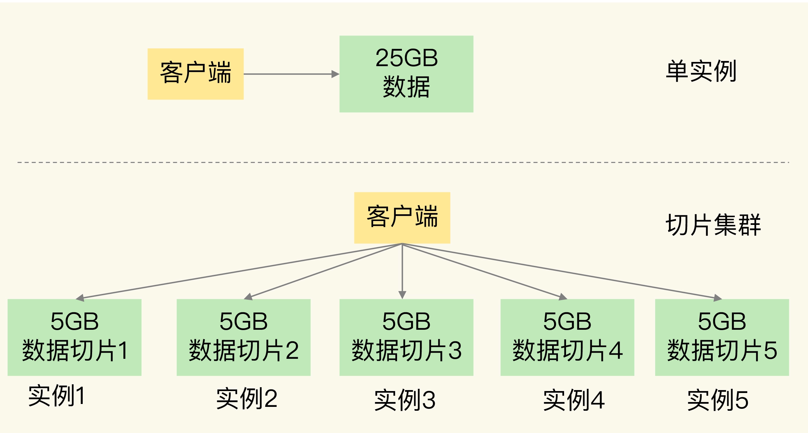
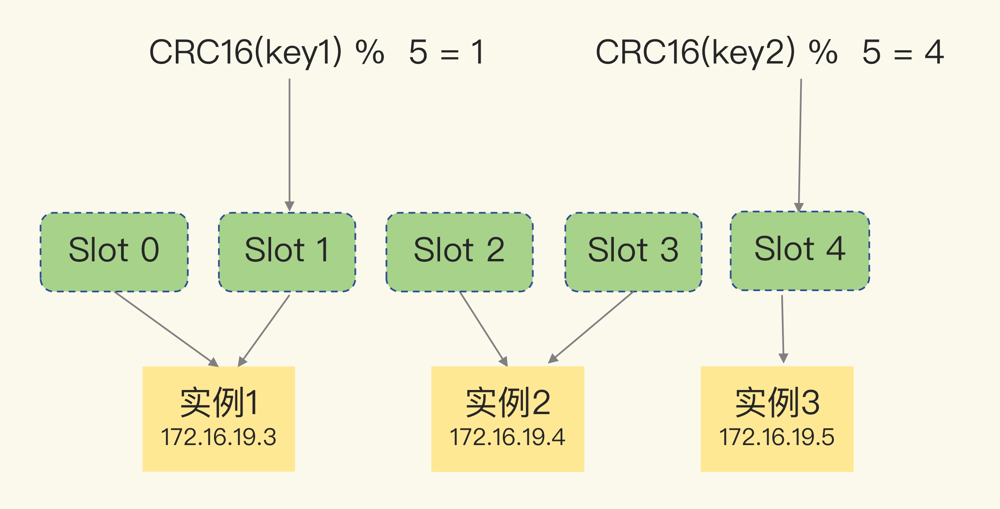
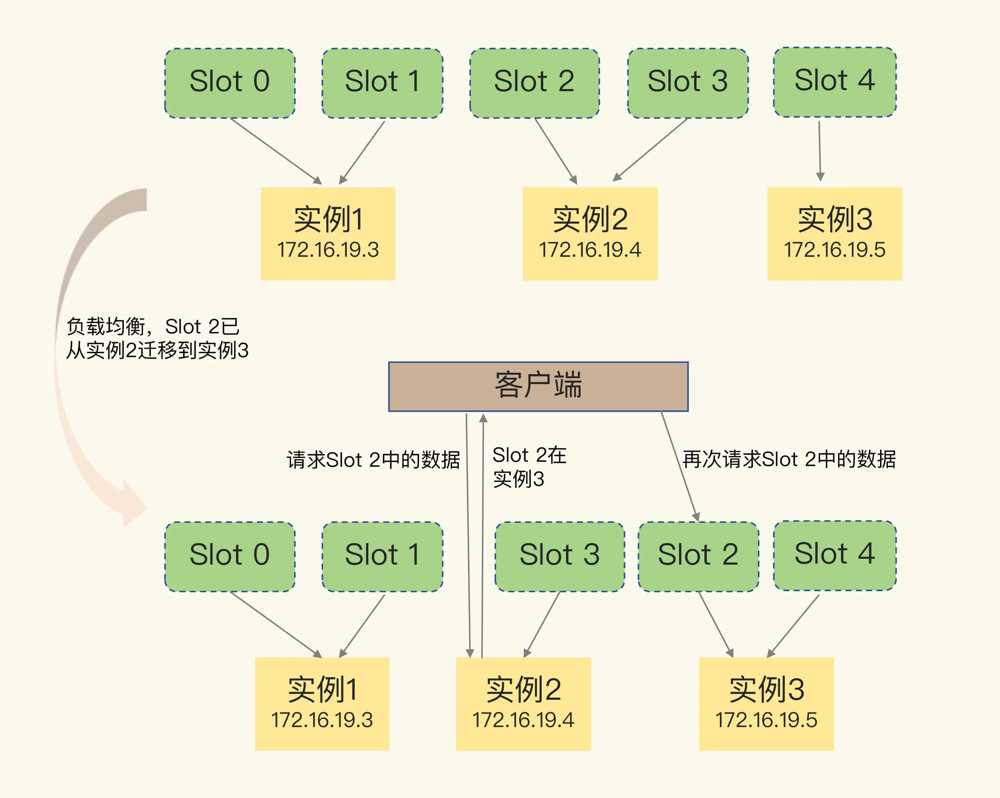

# Redis高可靠之切片集群
切片集群是指启动多个 Redis 实例组成一个集群，然后按照一定的规则，把收到的数据划分成多份，每一份用一个实例来保存。

## 数据与实例映射关系
Redis Cluster 方案中就规定了数据和实例的对应规则。

数据和实例之间通过哈希槽来映射。  
一个切片集群有16384个哈希槽，首先根据键值对的key，按照CRC16算法计算一个16bit的值；
然后对16384取模，得到0~16383范围内的模数，每个模数代表一个相应编号的哈希槽。

通过命令，我们可根据每个实例实际的资源配置情况，既能将哈希槽平均分配到各个实例，也能指定每个实例的哈希槽数。

## 客户端如何定位数据在哪个实例上
1. 每个实例知道自己的哈希槽信息
2. 每个实例会把自己的哈希槽信息发给和它相连接的其它实例
3. 客户端收到哈希槽信息后，会把哈希槽信息缓存在本地。当客户端请求键值对时，会先计算键所对应的哈希槽，然后就可以给相应的实例发送请求

在集群中，实例和哈希槽的对应关系并不是一成不变的，最常见的变化有两个：
* 在集群中，实例有新增或删除，Redis 需要重新分配哈希槽；
* 为了负载均衡，Redis 需要把哈希槽在所有实例上重新分布一遍。

此时用到重定向机制

MOVED命令：
        
    GET hello:key
    (error) MOVED 13320 172.16.19.5:6379
MOVED 命令表示，客户端请求的键值对所在的哈希槽 13320，实际是在 172.16.19.5 这个实例上。