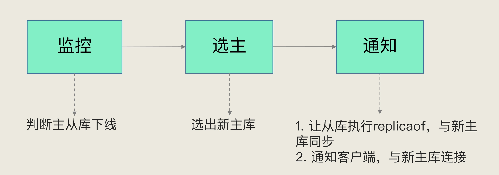

# Redis高可靠之哨兵机制
主从同步解决了主从库数据之间的一致性问题，但是还有其他问题待解决。
1. 如何监控主库的状态
2. 主库挂了，如何选新主？
3. 新主的信息如何通知其他从库

哨兵机制可解决这三个问题。  
哨兵是一个运行在特殊模式下的Redis进程。
## 一. 监控
周期性向所有主从库发送ping命令，响应超时的判为下线。  
但也可能误判，就是在网络拥塞或主库访问压力较大的情况下。如何减少误判呢？  
采用多实例组成的集群模式进行部署，这也被称为哨兵集群。半数以上的实例判断主库为“主观下线”，才能最终判定主库为“客观下线”。

## 二. 选新主库
### 1. 筛选
筛选条件
1. 从库当前为在线状态
2. 判断之前主从节点断连次数是否超过阈值

### 2. 三轮打分  
1. 优先级最高的从库得分高。  
通过配置项slave-priority手动配置

2. 和旧主库同步程度最接近的从库得分高。  
通过slave_repl_offset和master_repl_offset的差值判断同步程度

3. ID 号小的从库得分高  
每个实例都会有一个 ID，这个 ID 就类似于这里的从库的编号。在优先级和复制进度都相同的情况下，ID 号最小的从库得分最高，会被选为新主库。

## 三. 通知
在执行通知任务时，哨兵会把新主库的连接信息发给其他从库，让它们执行 replicaof 命令，和新主库建立连接，并进行数据复制。同时，哨兵会把新主库的连接信息通知给客户端，让它们把请求操作发到新主库上。

## 四. 总结
